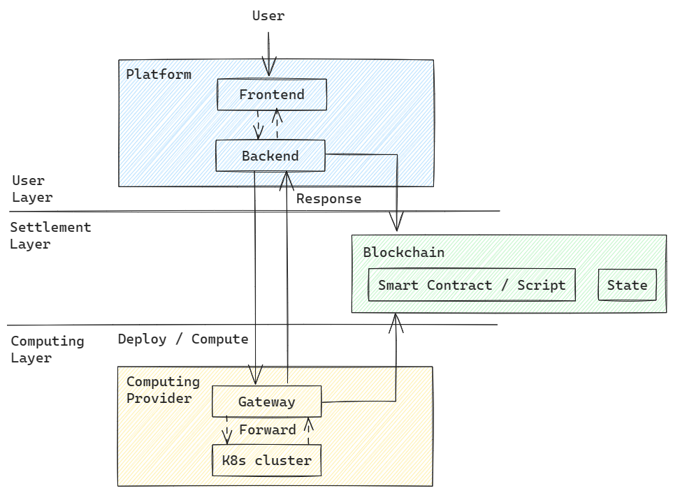

# GRID - 数据交易市场

## 引言

GRID 是一个综合性系统，为计算节点和用户提供了一个交易市场，能够自动结算服务费用。它允许计算节点利用 GRID 网关进行订单验证、应用部署和其他功能，同时注册他们的资源信息供用户选择和使用。

节点需要部署本地服务集群（例如 Kubernetes）来整合他们的本地计算资源。然后，他们启动本地的网关服务，并通过平台的节点注册功能注册他们的节点资源信息。平台向用户展示注册的节点，用户可以根据需要选择合适的节点提供服务。

用户可以从平台中选择满足他们要求的节点，与节点创建订单，并进行相应的支付。之后，他们可以开始使用节点资源，并通过网关 API 部署特定应用。一旦应用成功部署，用户可以直接通过节点网关访问部署的应用服务。

## GRID 中的角色

提供者是拥有计算资源并愿意服务用户以获得利润的节点。

用户是计算资源的消费者，支付给提供者的代币数量根据被提供者接受的资源数量和订单持续时间来确定。

### 提供者

计算节点作为计算市场的计算能力供应商。他们利用容器编排软件组织现有的硬件资源，包括处理器、内存、存储和显卡。随后，他们启动网关服务以提供各种 API 接口，实现节点功能，如身份认证、应用部署和应用访问。

在应用部署过程中，资源描述文件从提供的 YAML 文件 URL 中下载。节点随后与容器编排软件交互，将资源描述文件中描述的应用部署到本地环境，从而完成计算能力服务的提供。

部署本地基础设施并启动网关服务后，计算节点还需要通过 GRID 平台服务在区块链上注册他们的节点信息。这允许节点的公开曝光。用户节点可以通过平台提供的 API 接口访问所有注册的计算节点。

### 用户

作为用户，您是计算能力的消费者。首先，您需要购买用于支付计算服务的代币。根据资源的可用性和价格，您可以选择最合适的计算节点创建订单，并根据市场费率进行相应的支付。一旦订单激活，您就可以开始在计算节点上部署应用，实际使用购买的计算资源。

用户为订单支付的代币将根据提供给用户的实际服务时间进行结算。计算出的手续费将支付给计算节点，订单完成或取消后。任何剩余金额将退还给用户。

### 设计

架构由 3 层构成：



### 用户层

用户层由前端和后端组成，负责为各种节点（包括用户节点和提供者节点）提供大部分操作 API。
前端作为一个 webui，提供基于网络的用户界面与用户交互，代表用户向后台发送相应的请求。

后端处理前端用户发送的所有请求，当所有工作完成后，响应将发送回前端以显示结果。

### 结算层

结算层主要包括区块链上的几个智能合约，包括注册合约、市场合约、erc20 合约。

注册合约用于管理所有提供者的信息，包括资源和价格以及其他基本信息。

市场合约用于管理用户和提供者之间创建的所有订单。除了记录所有订单外，它还完成了结算任务，这是市场合约的核心功能。结算程序计算订单中应退还给用户的信用额度，以及提供者从这个订单中可以获得的信用额度，并支付给双方。

### 计算层

计算层在提供者上工作。它包含两部分，即网关和提供者上的 k8s 集群。
网关是提供者运行的守护程序，处理问候和计算请求。它与本地 k8s 集群交互以实现应用管理，如应用部署、访问和删除。

k8s 集群用于整合所有计算资源，并自动在容器中运行用户的应用镜像。

## 架构

### GRID 中的区块链

GRID 使用一些在区块链上运行的智能合约来实现结算功能。

区块链

区块链是一个去中心化的分布式账本，结合了分布式存储、点对点传输、共识机制和密码学等技术。在区块链中，数据通过加密算法和共识机制确保安全和可信。每个节点都维护整个系统的完整副本，并参与数据的验证和更新。区块链通过创建数据块（区块）记录交易信息。每个区块包含一定数量的交易数据和前一个区块的哈希值，形成一个不断增长的链。这种结构确保一旦数据被记录，就很难篡改，提供交易历史的透明度和可追溯性。因此，区块链技术广泛应用于数字信息存储、身份验证、智能合约执行、资产管理等领域。

在 GRID 项目中，区块链和在区块链上运行的智能合约用于促进计算能力节点的注册、存储用户节点服务订单和自动费用结算。整个结算过程由合约代码自动完成，无需人工干预，确保订单支付过程的透明度和安全性。

合约

节点合约用于记录节点（CP）的注册信息。

市场合约用于管理用户创建的订单信息，并完成结算操作。

erc20 合约用于管理所有账户的 erc20 代币。

### 网关

什么是 GRID 网关？

GRID 网关是由计算节点运行的守护程序，负责提供核心服务以实现项目功能，包括问候服务和处理服务。

问候服务：

它处理订单验证和应用部署。GRID 网关部署在每个资源节点（CP）上，接收用户请求并执行与节点的本地 Kubernetes 集群相关的任务。这使得用户应用可以部署到节点的 Kubernetes 集群。

处理服务：

它将用户请求转发到计算节点上部署的 Kubernetes 计算集群，并将用户应用的响应数据返回到前端以供显示。

1 授权

问候接口的第 2 类请求：用户身份验证和 cookie 发行

订单收款人验证成功后，用户需要签署请求以证明他们的身份。一旦验证成功，将向用户发放授权 cookie。收到 cookie 后，用户可以继续应用部署和使用。

2 应用部署

完成之前的验证步骤并获得授权令牌（cookie）后，可以使用网关的应用部署功能。

在部署请求中，需要提供与应用相对应的 YAML 文件 URL 以确定应用要使用的镜像信息。部署功能将下载并解析 YAML 文件，在 YAML 文件中描述的应用，并在成功部署后为应用生成相应的服务。最后，服务将在相应的应用入口点为用户注册。入口点将在转发功能中获得，并用作反向代理请求转发的目标 URL。

3 请求转发

GRID 网关不直接处理用户应用访问请求。相反，它通过网关提供的反向代理将用户请求转发到应用入口点（入口），并检索应用的响应。

流程如下：

网关接收到处理请求。

它检索用户在应用部署期间注册的应用入口地址。

网关使用反向代理将传入请求转发到应用的入口点，并检索应用的响应。

最后，反向代理将从请求中获得的响应数据返回给前端，完成转发过程。

### 提供者的基础设施

提供者必须准备一些本地环境以使其可用。

1 提供者基础设施

提供者部署 Kubernetes 容器编排软件。提供者负责根据其可用资源规划要部署的节点数量，并将这些节点添加到 Kubernetes 集群。用户部署的应用将在这些节点上运行，提供者必须确保所有本地节点正常运行以确保用户应用的顺利运行。

2 Kubernetes

在 GRID 项目中，资源节点（CP）通过 Kubernetes（通常缩写为 K8s）集群整合其资源。

以下是 Kubernetes 的基本介绍：

Kubernetes 是一个开源的容器编排平台，用于自动化部署、扩展和管理容器化应用。它提供了一个高度可扩展的集群管理解决方案，可以运行在云或本地基础设施上。

Kubernetes 的设计目标是简化容器化应用的部署和管理。它提供了一个强大的平台，自动化容器调度、扩展、存储管理、网络和应用健康监控等任务。Kubernetes 还提供了丰富的功能，如服务发现、负载均衡、密钥管理、配置管理，以帮助开发人员构建和管理可靠的分布式应用。

Kubernetes 使用一组容器称为“Pods”来组织应用的部署单元。Pods 是一组共享相同命名空间的容器，允许它们共享网络和存储资源，并通过高速本地网络通信。Kubernetes 还提供了一个强大的调度器，根据资源需求、健康状况和其他策略将 Pods 部署到集群中的节点。

除了基本的容器编排能力外，Kubernetes 支持自定义资源定义（CRD）和控制器扩展机制，允许用户自定义和扩展 Kubernetes 的行为。这使得 Kubernetes 成为一个高度可定制和可扩展的平台，适合不同规模和类型的各种应用场景。

总之，Kubernetes 是一个流行的容器编排平台，广泛用于构建、部署和管理容器化应用。它帮助用户实现高度自动化、弹性和可靠的应用部署和运维。

3 YAML

在 Kubernetes（K8s）中，YAML 文件通常用于定义和配置 Kubernetes 资源。它们是使用 YAML（YAML Ain't Markup Language）语法编写的文本文件。通过编写适当的 YAML 文件，可以创建、部署和管理各种 Kubernetes 资源，如 Deployments、Services、ConfigMaps、PersistentVolumeClaims 等。

在 YAML 文件中，我们可以指定 Kubernetes 资源的 API 版本、类型、元数据和规范。

以下是一个 YAML 文件的示例：

```json
apiVersion: apps/v1

kind: Deployment

metadata:

name: my-deployment

spec:

replicas: 3

selector:

matchLabels:

app: my-app

template:

metadata:

labels:

app: my

-app

spec:

containers:

- name: my-container

image: my-image:latest

ports:

- containerPort: 8080
```

在示例中，我们定义了一个名为“my-deployment”的 Deployment，它将创建三个副本。副本与使用标签选择器匹配标签“app: my-app”的 Pods 相关联。Deployment 的模板部分定义了要部署的 Pods 的规范，包括容器的镜像、端口等详细信息。

通过使用 YAML 文件，我们可以实现声明式配置，即通过定义期望的 Kubernetes 资源状态和规范来描述 Kubernetes 资源的期望状态。Kubernetes 控制器负责确保集群的实际状态与期望状态一致。

使用 YAML 文件可以轻松创建、更新和删除 Kubernetes 资源，实现应用的自动化部署和管理。此外，YAML 文件提供了高度可读的格式，简化了 Kubernetes 资源的配置和可靠共享。

### 平台

GRID 平台提供各种常用服务的接口，以满足不同用户的需求。这些服务包括计算节点注册、订单创建、代币转账、ERC20 存款等其他功能。

1 提供者注册/列表

在合约中注册其资源信息的目的是使计算节点能够将其资源告知用户节点。只有注册的计算节点才能被用户节点发现，并为用户提供计算服务。

2 订单创建

它用于用户根据其资源需求与选定的节点创建服务订单，并支付相应的订单费用。

3 代币转账

用户通过代币转账使用代币进行实际支付。一旦代币转账成功，用户可以将代币转换为信用额度，通过将其存入他们的信用额度账户。然后使用信用额度支付订单费用。

4 信用购买

用户使用代币转账记录为等额的信用额度充值。这些信用额度可用于购买订单。每个订单的费用根据订购资源的数量、节点提供的资源单位价格和订单服务的持续时间来计算。使用信用额度支付订单费用。

5 信用查询

查询用户信用账户的当前余额。

6 TX 确认

代币交易（转账）是链上操作，区块链上的交易确认需要一些时间。刷新接口用于验证转账交易是否已完成，并将转账的确认状态更新为真。
