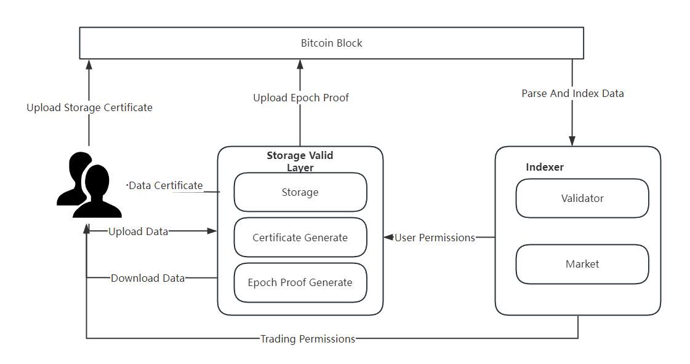

# Meeda & Mooda

## Meeda

Meeda是由[Memolabs](https://memolabs.org/)推出的基于以太坊安全性的数据可用性解决方案，为以太坊Rollup提供可靠的数据可用性保障。

Meeda的命名来源于MEMO、Ethereum、data availability这些单词，并且与Memolabs推出的比特币数据可用性解决方案Mooda进行联动，前两个字母共同组成MEMO。

### DA问题

对于区块链来说，数据可用性（DA）是一件很重要的事情。众所周知，共识是组成区块链的重要一环，节点达成共识，从而共同维护当前链的状态。而节点要想达成共识，首先节点需要认可当前链的状态更改，要验证当前链的状态更改是否正确，就需要能够访问交易数据，执行交易获得交易结果，从而验证当前链的状态更改是否正确。所以保证交易数据能够被任意节点访问是区块链能够正常运行中非常重要的一环。

保证交易数据能够被任意节点访问就被称为数据可用性（DA，Data Availability）。任意节点可以访问到未被最终确认的区块中包含的交易数据，从而验证交易是否正确，以此防范恶意交易上链，维持区块链正确的“记账”记录，保障区块链的安全可靠性。对数据可用性更详细的描述，请参考https://ethereum.org/en/developers/docs/data-availability/。

在像以太坊这样的整体区块链中，DA通常作为单个系统设计的一部分，在区块空间有限而区块空间利用率较高时，Gas费会越来越高，单笔交易成本越来越高，用户体验会越差，Web3的发展也会受制。

以太坊最近几年也意识到了扩容问题，开始探索各种链下扩容解决方案，当前，Rollups已经成为流行的解决方案，但是在Web3生态繁荣、区块空间需求较高时，仍然面临Gas费过高问题。

#### 当前DA解决方案

Layer2作为以太坊的扩容方案，已经能够安全可靠的对Layer1进行扩展，提升吞吐量并降低交易费开销。但其仍存在一个问题：无法降低数据的同步开销和存储开销。原始的交易数据仍然需要提交到L1链上，L1上的全节点仍需要同步这些交易数据。即使有一些别的方案，如ERC-4337来压缩部分交易数据，以及EIP-4844引入了`blob`交易类型，但效果仍旧有限。最直观的体现就是，这些交易数据存放在L1链上仍需要支付高昂的gas费用，尽管这些费用是字节费用而非执行费用。

究其根本，还是因为Layer2将以太坊L1链当作自己的DA层。

### Meeda解决方案

#### Meeda概览

Meeda将blob数据放在链下存储，获取数据用的索引和保证数据可用性的承诺证明放在链上存储。在保证了数据可用性的同时，也降低了链上的同步开销和存储开销，最大程度扩展区块链。Meeda兼容任何Optimistic类型的Layer2链，为其提供可靠的数据可用性保障。Meeda依靠链上验证、持续性证明以及冗余机制保障数据的可用性。

在链下，Rollup将blob数据上传至Meeda，Meeda保障blob数据的可用性，任意节点都可以快速方便地读取blob数据。在链上，Meeda会定期往链上提交数据可用性证明。

#### Meeda架构

下面的图片展示了Meeda的基本架构信息。

Meeda的架构中包含四个主要组成部分：

1. Operator：接收blob数据，对blob数据进行冗余编码和分割，随后将其分散发送到Storage Nodes；生成blob数据的索引信息commitment，并上传至链上，以便用户获取数据；聚合Storage Nodes生成的数据可用性承诺证明，将聚合证明提交至链上，以便进行链上验证。
  
2. Storage Nodes：存储blob数据的节点；根据链上周期生成的seed信息，持续性生成数据可用性承诺证明，并发送给Operator。
  
3. 验证合约：主要负责链上验证。根据VRF-Sampling（Verifiable Random Function）周期生成seed信息，用于后续的证明生成和证明验证；对持续提交的聚合证明进行验证；并且保存用于获取数据的索引信息commitment。
  
4. Light Node：对链上验证发起挑战。

## Mooda

Mooda （Memo Bitcoin Ordinals Data Availability）是一个基于比特币的持续可验证的数据可用层，以在不牺牲安全性的情况下提高比特币的存储效率，降低存储成本，使用Mefs（Memolabs的分散式存储系统）提供存储服务，使用比特币区块存储验证信息，通过线下的索引器完成整个系统的验证和状态变更。Mooda的目标是为比特币生态用户提供一个低门槛、低成本、高效率、高安全的数据可用层。

### 铭文系统

#### 铭文

因为比特币空间大小的限制，导致比特币上的数字收藏品生态一直不温不火，直到比特币经过见证隔离SegWit和Tarpoot升级后，用户已经可以在每笔交易中写入4MB大小的内容，此时比特币的技术和空间对于数字藏品应用都已经足够，因此基于比特币的数字资产铭文应运而生。

铭文是一段采用序数协议（ordinals）铭刻（inscribe）在聪（比特币的最小计账单位）上的数据。在比特币区块链的背景下，铭文的出现使得用户可以将4MB以下任何形式的内容铭刻到指定聪上，由比特币区块进行持久化存储。铭文的出现为比特币生态带来了新的功能和应用场景，尤其是在数据存储和非同质化代币（NFT）等领域。

序数协议是一种对聪进行编号的方案，能够对单个聪进行跟踪和转移。编号的方案取决于开采聪的顺序，转移方案取决于交易输入和输出的顺序。序数协议可以将任何形式的内容作为稳定的标识符附加到聪上。

由于Taproot脚本只能从现有的Taproot输出中使用，所以铭文通过提交和揭示两个阶段来实现铭文内容的展示，这两个阶段的过程就被称作为铭刻。

#### 索引器

尽管铭文技术为比特币生态带来了创新的发展机遇，但是比特币的脚本语言仍然存在局限性：无法直接处理复杂的逻辑和程序。为了克服这一图灵不完备性的挑战，生态用户引入了比特币索引器的概念。索引器作为一种补充解决方案，使得比特币能够间接处理更复杂的逻辑，从而扩展了其功能并增强了其在现代区块链应用中的适用性。通过这种方式，比特币索引器为比特币网络解锁了新的潜力，推动了其在金融科技和其他领域的进一步发展。

索引器通过检索比特币的区块和交易数据，获取铭刻于区块中的数据，结合线下的存储层构建出图灵完备的系统。

索引器包含以下几个功能：

1. 检索链上数据（找出铭刻于聪上的数据）

2. 筛选链上数据，确定状态，确定数据归属（谁上传的），确定数据权限（谁可以下载）

#### BRC-721

BRC-721是一个基于比特币实现非同质化代币（NFT）的协议 ，通过设计特定格式规范的铭文，从而实现代币的部署、铸造、转移、更新等操作，为在比特币区块链上实现非同质化代币提供了一种解决方案。

BRC-721通过第三方存储保证数据的可用性，主要服务于数字资产等轻量级的存储应用，不适用于用户需要进行大量数据存储的应用。此外，即使使用ipfs作为存储方案也会面临用户数据无法保密的问题，这种方案不能满足用户存储隐私数据的需求。

### 当前问题

将数据直接存储到比特币区块链上，虽然获得了不可篡改和持久化的特性，但是也存在一些显著的缺陷和挑战：

1. 链上存储需要支付交易费用，每次数据的读写都需要作为交易被添加到区块链上，对于大量数据，这些费用可能会变得非常昂贵。某匿名钱包花费1.5个比特币（价值约66000美元）铭刻了近9MB的数据。

2. 区块链网络通常有着严格的数据限制，每个区块的存储数量有限，尽管比特币经过了Taproot升级，将单笔交易中可写入的数据从80字节的限制提升到了大约4MB，但是仍然不能满足网络中日益增长的存储需求。

3. 随着区块链网络的增长，链上数据的增加可能会导致网络拥堵，降低交易处理速度，随着铭文的火爆，比特币链网络中常常出现一个铭文将整个区块占满的情况，影响其他交易数据的打包。

4. 区块链网络的数据通常是公开的，意味着任何人都能查看存储到链上的信息，这可能会引发隐私泄露的风险，尤其是需要保密的存储场景。

为了解决比特币中的上述问题，生态参与者提出了数据可用层的概念。

### 数据可用层

数据可用层（Data Availability Layer）是用来解决区块链网络中数据存储和可访问性问题的新兴方案，它可以确保所有的网络参与者都能快速且容易的访问到用户数据和其他信息。

数据可用层具有以下特点：

1. 通过将数据存储任务从链上分离出来，有助于减轻链上负担，提高整个网络的处理速度和效率。

2. 可以提供数据验证机制，确保数据的准确性和完整性，同时不会暴露数据本身，提高了存储的隐私性。

3. 可以通过在存储层添加权限控制，保障用户的数据安全以及隐私性需求。

4. 数据存储通常采用分布式存储，有助于保持整个网络的去中心化特性。

5. 兼容性强可以支持多个区块链网络。

### Mooda解决方案

Mooda将数据存储于链下的分散式存储中，将数据的存储凭证和验证信息放在比特币区块链上，验证节点可以随时从链上获取验证信息和存储凭证，来验证存储中的数据是否存在。 

Mooda由三个部分组成：存储验证层、比特币区块和索引器。Mooda将用户数据存储于线下的去中心化存储，将存储的证明和验证信息存放于比特币链上，使用索引器获取并验证链上的验证信息。

Mooda通过周期性向区块链提交证明，实现验证的可持续性，为了防止存储证明层使用同一证明，每个周期会选定一个随机数参与证明的生成。

#### 存储验证层

存储验证层包含数据存储、凭证生成和周期证明生成。用户上传数据后，存储验证层返回数据存储凭证，用户将凭证上链后，存储验证层会在每个周期都上传证明到链上，根据索引器提供的数据权限，给有权限的用户提供下载服务。

* 存储：通过Mefs等提供可靠安全的去中心化存储，为整个系统提供存储服务，提供上传下载接口，存储数据。

* 凭证生成：根据用户上传的数据，生成数据的存储凭证，用以向用户证明存储的对象与存储时间。

* 数据周期证明：数据周期证明包含周期和证明两种信息，周期确定验证的范围，证明用来保证数据在这个周期存在于存储中，为了确保每个周期的证明不可预测，引入一个随机数参与证明的生成。

#### 索引器

索引器（Indexer）监控比特币网络上的区块和交易，获取交易中存储的验证信息，并根据验证信息验证用户数据的正确性，用以确保数据的可用性。

索引器包含验证者和市场两个部分：

* 验证者：验证者负责对索引器获取的数据进行验证，从而确认用户的数据被存储层有效保管。

* 市场：用户可以将存储的数据权限进行交易，拥有读权限的用户可以从存储验证层中获取对应的数据。

#### 比特币上的铭文

Mooda通过铭文存储数据的凭证、证明、周期等信息，从而让这些关键而少量的信息在比特币上被持久化存储，将这些信息公开透明地展示给所有的验证者，以供验证者验证数据的可用性。

Mooda 的铭文分为三类：

* 数据唯一凭证铭文：数据唯一凭证是存储验证层根据数据内容生成的唯一凭证，用以向用户证明数据已经被存储。铭文包含存储的签名以及数据的hash值。

* 周期铭文：周期铭文包含时间信息，是整个持续验证系统的尺度，用于让验证者确认验证的范围，同时提供一个随时间变化的随机数，使得存储证明的生成不能被预测。

* 数据证明铭文：数据证明铭文包含存储验证层根据数据和周期铭文提供的随机数生成的证明，由存储验证层周期性的提交到比特币网络中。

Mooda使用周期铭文的铭文id作为随机种子，随机种子是一个参与验证的随机值，用于防止预测攻击。

### 技术亮点

Mooda通过引入周期铭文的概念，确定了可用性证明上传的周期，同时也解决了零知识证明中获取随机种子的问题。

通过将凭证信息和证明信息存放于比特币网络中，从而进行持久化存储，同时将用户数据存储于链下去中心化的存储系统中，从而实现了整个数据可用层的低成本、高可扩展性以及去中心化特性。

依托于现有的比特币铭文，降低了用户的使用门槛，用户可以方便快捷的使用Mooda解决比特币中的数据可用性问题。
