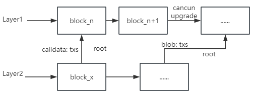
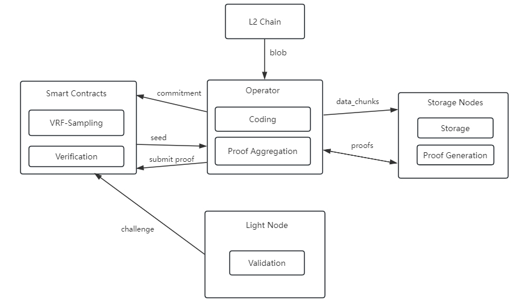

# Meeda

Meeda是由[Memolabs](https://memolabs.org/)推出的基于以太坊安全性的数据可用性解决方案，为以太坊Rollup提供可靠的数据可用性保障。

Meeda的命名来源于MEMO、Ethereum、data availability这些单词，并且与Memolabs推出的比特币数据可用性解决方案Mooda进行联动，前两个字母共同组成MEMO。

## DA问题

对于区块链来说，数据可用性（DA）是一件很重要的事情。众所周知，共识是组成区块链的重要一环，节点达成共识，从而共同维护当前链的状态。而节点要想达成共识，首先节点需要认可当前链的状态更改，要验证当前链的状态更改是否正确，就需要能够访问交易数据，执行交易获得交易结果，从而验证当前链的状态更改是否正确。所以保证交易数据能够被任意节点访问是区块链能够正常运行中非常重要的一环。

保证交易数据能够被任意节点访问就被称为数据可用性（DA，Data Availability）。任意节点可以访问到未被最终确认的区块中包含的交易数据，从而验证交易是否正确，以此防范恶意交易上链，维持区块链正确的“记账”记录，保障区块链的安全可靠性。对数据可用性更详细的描述，请参考https://ethereum.org/en/developers/docs/data-availability/。

在像以太坊这样的整体区块链中，DA通常作为单个系统设计的一部分，在区块空间有限而区块空间利用率较高时，Gas费会越来越高，单笔交易成本越来越高，用户体验会越差，Web3的发展也会受制。

以太坊最近几年也意识到了扩容问题，开始探索各种链下扩容解决方案，当前，Rollups已经成为流行的解决方案，但是在Web3生态繁荣、区块空间需求较高时，仍然面临Gas费过高问题。

### 当前DA解决方案

Layer2作为以太坊的扩容方案，已经能够安全可靠的对Layer1进行扩展，提升吞吐量并降低交易费开销。但其仍存在一个问题：无法降低数据的同步开销和存储开销。原始的交易数据仍然需要提交到L1链上，L1上的全节点仍需要同步这些交易数据。即使有一些别的方案，如ERC-4337来压缩部分交易数据，以及EIP-4844引入了`blob`交易类型，但效果仍旧有限。最直观的体现就是，这些交易数据存放在L1链上仍需要支付高昂的gas费用，尽管这些费用是字节费用而非执行费用。

究其根本，还是因为Layer2将以太坊L1链当作自己的DA层。

## Meeda解决方案

### Meeda概览

Meeda将blob数据放在链下存储，获取数据用的索引和保证数据可用性的承诺证明放在链上存储。在保证了数据可用性的同时，也降低了链上的同步开销和存储开销，最大程度扩展区块链。Meeda兼容任何Optimistic类型的Layer2链，为其提供可靠的数据可用性保障。Meeda依靠链上验证、持续性证明以及冗余机制保障数据的可用性。

在链下，Rollup将blob数据上传至Meeda，Meeda保障blob数据的可用性，任意节点都可以快速方便地读取blob数据。在链上，Meeda会定期往链上提交数据可用性证明。

### Meeda架构

下面的图片展示了Meeda的基本架构信息。

Meeda的架构中包含四个主要组成部分：

1. Operator：接收blob数据，对blob数据进行冗余编码和分割，随后将其分散发送到Storage Nodes；生成blob数据的索引信息commitment，并上传至链上，以便用户获取数据；聚合Storage Nodes生成的数据可用性承诺证明，将聚合证明提交至链上，以便进行链上验证。
  
2. Storage Nodes：存储blob数据的节点；根据链上周期生成的seed信息，持续性生成数据可用性承诺证明，并发送给Operator。
  
3. 验证合约：主要负责链上验证。根据VRF-Sampling（Verifiable Random Function）周期生成seed信息，用于后续的证明生成和证明验证；对持续提交的聚合证明进行验证；并且保存用于获取数据的索引信息commitment。
  
4. Light Node：对链上验证发起挑战。

### 使用Meeda

请查阅[Meeda Docs](https://memolabs.gitbook.io/meeda)
