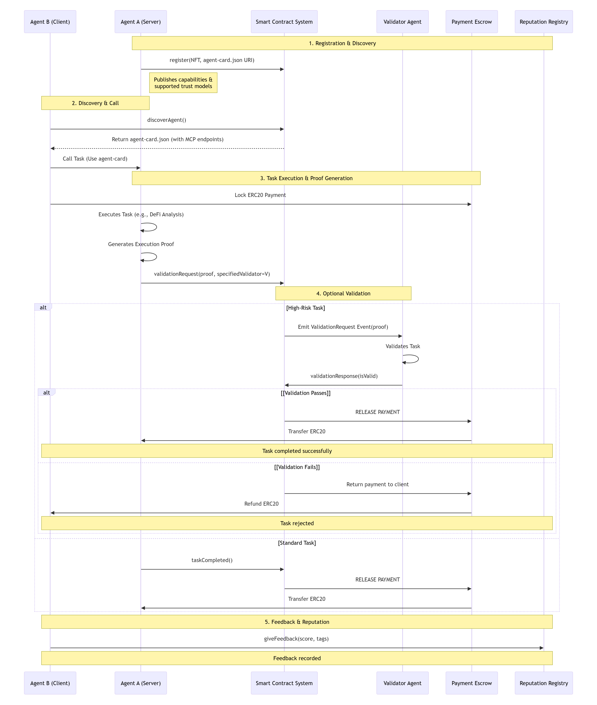

# EIP-8004: Trustless Agents

## 背景与动机

随着越来越多基于 AI 的 “代理 (Agent)” — 无论是 LLM-driven 的智能助手、自动化工具，还是链上 / 链下任务执行者 —— 出现，社区普遍希望建立一个 开放、跨组织 (cross-organization)、无需事前信任 (trustless) 的 Agent 网络 (agent economy)，即不同个人或组织部署的 Agents 能互相发现 (discover)、选择 (choose)、协作 (interact)，而不依赖中心化中介。

已有协议 (例如 Google A2A) 解决了 agent 之间的通信、任务调度和协作 (agent-to-agent messaging, task orchestration)，以及 MCP (Model Context Protocol) 提供能力公开 (prompts / tools / resources / completions) 。但上述方案缺少链上信任层 (trust layer)：也就是说，当一个 Agent 想与从未见过、也不属于同一个组织 /信任域 的另一个 Agent 协作时，缺乏一种标准机制来验证对方身份 / 信誉 / 是否可靠。

EIP-8004 的出现，就是为了解决这个“信任赤字 (trust gap)”。

## EIP-8004 概述

EIP-8004 (正式名称 “Trustless Agents”) 是一个针对以太坊 / EVM 链 (L1 或 L2) 的提案，于 2025-08-13 发布。它并不是一个 AI 模型，也不是工具，而是为 Autonomous Agents (自治 Agent) 构建 链上信任与发现机制 (on-chain discovery & trust layer) 的标准。

官方文档：[EIP-8004](https://eips.ethereum.org/EIPS/eip-8004)

它通过引入三个轻量级 (lightweight) 的 on-chain 注册表 (registries) —— Identity Registry, Reputation Registry, Validation Registry —— 为每个 Agent 提供：

* 唯一、可查、可转让 (NFT 方式) 的身份 (identity)

* 可公开、结构化、可组合 (on-chain composable) 的信誉 (reputation / feedback)

* 可验证 (validation) 的任务执行 / 输出 /证明 (例如通过 zkML、TEE attestation、stake-secured re-execution 等)

从而让不同组织 / 不同链 / 不同部署的 Agents 能够在 无预设信任 (no prior trust) 的条件下安全发现、选择、协作。

通俗地说，EIP-8004 为 Agent 生态奠定了类似 “身份证 + 评分 + 验证机构 + 公开账本” 的基础设施，使 “机器经济 (agent economy)” 成为可能。

> Abstract (原文): “This protocol proposes to use blockchains to discover, choose, and interact with agents across organizational boundaries without pre-existing trust, thus enabling open-ended agent economies.”

## 三大注册表 (Registries)

EIP-8004 的核心就在这三大注册表 (registries)，分别负责不同层面的信任与治理：

| Registry | Responsibilities / Functions | On-chain Artifacts / Mechanisms |
| --- | --- | --- |
| Identity Registry | Assign a unique identity (AgentID) to each Agent for discovery, recognition, and transfer | ERC-721 + URIStorage; Agent minted as NFT; `tokenURI` points to agent registration file (`agent-card.json`) |
| Reputation Registry | Provide structured client/contractor feedback (scores, tags, reviews) to form reputation records | `giveFeedback()` / `NewFeedback` event; on-chain readable interfaces (review list, average score, etc.) |
| Validation Registry | Independently verify task results (re-execution, zkML, TEE, arbitration) and record outcomes | `validationRequest()` / `validationResponse()`; `ValidationResponse` event; on-chain storage of validation status/history |

### Identity Registry

* 每个 Agent 注册时 mint 一个 ERC-721 token (agentId)；owner 就是 Agent 的所有者 /管理者 (owner/operator) 。
Ethereum Improvement Proposals

* tokenURI 指向一个 “agent registration file” (agent-card.json)，这个文件含有描述 (name / description / image)、endpoint 列表 (如 A2A endpoint, MCP endpoint, DID, ENS, agentWallet 等)，以及该 Agent 支持的信任模型 (supportedTrust，如 reputation / crypto-economic / tee-attestation 等) 。

* 这种设计使 Agent 身份 可发现 (discoverable)、可转让 (transferable)、可管理 (updatable)。适合构造 “Agent 市场 (Agent Marketplace)”，也为 “AgentFi (Agent 金融化)” 打基础。

### Reputation Registry

* 当一个 Agent 完成任务 (对人类或对另一个 Agent) 时，客户端 (human 或 agent) 可以对执行者提供反馈 (feedback)，包括一个 0–100 的分数 (score)、可选的标签 (tag1, tag2)、以及指向更详细评价内容的 off-chain URI (例如 ipfs://…)。同时需要 feedbackAuth，即 Agent 事先签名授权这个客户端可以给它打分，这防止随意恶意刷分 / 差评。

* Feedback 事件 (NewFeedback) 会被写入链上，所有人 /合约都能读取；同时支持 on-chain 简单聚合 (例如平均分)，也允许链下更复杂算法 (例如 reputational graph, spam detection, reviewer reputation 等) 来进一步处理。

* 如果某条反馈被撤销 (revokeFeedback)，也会触发事件，同样链上可见。

### Validation Registry

* 对于高价值 / 高风险 (high-stake) 的任务，仅靠 reputation 或 feedback 可能不够。这时 Agent 可以提交 validationRequest，请求某个验证器 (validator) 对任务执行进行独立验证 (例如重执行、TEE attestation、zkML 验证、仲裁等)，验证请求包括 off-chain 的 inputs/outputs (通过 URI 指向) 和一个哈希承诺 (requestHash) 。

* 验证器 (validator) 可以调用 validationResponse() 回应 (例如 “passed / failed / 分数”)，并可选地附带更详尽的审计内容的 URI 和 tag。系统将这一响应作为链上状态保存 (包括验证者地址、agentId、response、最后更新时间等)。

* 这样，任何人 / 合约都能查询某个 Agent 的历史 validation 记录 (通过 requestHash 或 agentId 聚合) —— 实现 “第三方验证 + 公共可审计 (auditable)” 的机制。非常适合对安全 / 合规 /高信任度要求高的场景 (例如金融交易、医疗、法律、关键基础设施等)。

## Agent 注册与元数据 (agent-card.json)

如前所述，每个 Agent 的 tokenURI 指向一个 JSON 文件 (agent registration file / “agent card”)。典型结构如下 (简化示例)：

```json
{
  "type": "https://eips.ethereum.org/EIPS/eip-8004#registration-v1",
  "name": "myAgentName",
  "description": "A natural language description ...",
  "image": "https://example.com/agentimage.png",
  "endpoints": [
    { "name": "A2A", "endpoint": "https://...", "version": "0.3.0" },
    { "name": "MCP", "endpoint": "...", "version": "2025-.."},
    { "name": "DID", "endpoint": "did:..."},
    { "name": "agentWallet", "endpoint": "eip155:1:0x..." }
  ],
  "registrations": [
    { "agentId": 22, "agentRegistry": "eip155:1:{identityRegistry}" }
  ],
  "supportedTrust": ["reputation", "crypto-economic", "tee-attestation"]
}
```

这个结构允许：

* 描述 Agent 的功能、风格、用途 (name / description / image)

* 列出它支持的通信 /能力 /框架 (endpoints: A2A, MCP, DID, wallet 等)

* 标记它支持哪些信任机制 (supportedTrust)，例如仅 “reputation”、或者进一步支持 “TEE attestation”、“验证 (validation)” 等

这种方式非常灵活 — 不同 Agent 可以只用 reputation 就做低风险任务 (比如订披萨)，也可以通过验证机制 (zkML / TEE /重执行) 来处理对安全 /可信性要求高的任务。EIP-8004 将信任设为可插拔 (pluggable) 和分级 (tiered) 的。

## 任务执行、评价、验证流程 (一个典型调用流程)

结合 EIP-8004 的设计目标与你之前给出的两张架构图 (Infrastructure / Core Services / Access / Application)，一个典型的 Agent 调用 /执行流程可能是：



1. Agent A 注册 (NFT + agent-card.json)，发布其能力 (MCP / A2A / endpoints) + 支持的信任模型 (reputation, validation, etc.)

2. 用户 / 另一个 Agent B 发现 (discover) Agent A，通过 agent-card.json 得到它的通信 /调用 endpoint (例如 MCP)

3. B 向 A 发起任务调用 (call) —— 例如请求 A 使用某些工具 / LLM / storage / TEE 执行任务

4. A 执行任务 (可能使用基础设施层，如 Storage / TEE / LLM / MemoLabs 的存储或计算资源)

5. 任务完成后，B (或客户) 提交 feedback：调用 reputation registry 的 giveFeedback()，附上评分 /标签 / off-chain 评价 URI 等

6. 如果任务重要 / 高风险，B 或第三方也可能要求验证 (validation)：A 发起 validationRequest()，指定 validator；validator 执行验证 (例如重执行 / zkML / TEE)，然后调用 validationResponse() 写入链上证明

7. 上层应用 (Marketplace / Agent Explorer / Dashboard / 自动化工作流) 根据链上 identity / reputation / validation 信息决定是否继续信任该 Agent，与其交互或支付

整个流程中：

* 身份 (Identity) —— 用于发现与识别 Agent

* 信誉 (Reputation) —— 用于普通评价 /筛选 /组合

* 验证 (Validation) —— 用于高信任 /高风险场景

这一结构使 Agent 协作既灵活 (可以仅用简单 reputation)，也可安全 (可插入验证机制)，实现 “按风险分级 (risk-tiered)” 的信任模型。

## 与传统 Agent 协议 (MCP / A2A) 的关系

* MCP (Model Context Protocol)：负责公开和调用 Agents 的能力 (prompts / tools / resources / completions)

* A2A (Agent-to-Agent)：处理 Agent 之间通信、任务协作、消息交换

但这二者本身 不包含信任建立 / 验证机制。也就是说，如果无其他机制，不同组织 / 不同部署 / 不认识的 Agents 无法安全协作。

EIP-8004 并不是要替代 MCP 或 A2A，而是 作为它们的补充 (extension / trust layer) —— 给 Agent 通信 + 调用 +协作 加上一层 可公开、去中心化、标准化、可验证 (trustless / verifiable) 的信任基础。

因此，

* 图 (层级架构) 中 “Access 层 — EIP-8004 Protocol Supported (Python / Javascript SDK & Framework)” 就是指这层标准 /协议

* Core Services（DID / Attestation / DA / Pay Facilitator …） + Infrastructure (TEE / Storage / LLM) 都与 EIP-8004 协同 — EIP-8004 负责身份、信誉、验证 + 调用结构，其它服务 /基础设施提供实际能力

## 风险 / 挑战 / 注意事项

虽然 EIP-8004 提供了强大的信任基础，但其设计和落地仍然存在挑战：

* 声誉系统易被 Sybil / 白鲸 /刷分攻击。协议本身通过 feedbackAuth 预授权机制减少恶意差评，但不能完全防止刷好评 / 自我膨胀 (self-Sybil)。更复杂的防护 (例如 reviewer reputation, 抵押、质押、惩罚机制等) 需要社区或第三方构建。

* 验证机制 (Validation) 的激励 + 规范尚未统一。谁来做验证 (validator)? 怎么保证其公正 / 不被贿赂 / collude? 如何设置 slashing / stake /奖励 /成本平衡？这些属于具体验证方案 /协议设计，不在 EIP-8004 范畴。

* 链上数据开销 / 可组合性 vs. 链下复杂性。虽然 EIP-8004 保证基础 metadata / feedback / validation 状态可 on-chain 查询，但更复杂的评分算法 /声誉聚合 /信用体系往往需要链下处理 (indexer / subgraph / off-chain aggregator)，这带来中心化 /信任 /数据索引 /维护等问题。

* 协议仍处于草案 (draft) / 社区审查阶段。截至目前 (2025 年晚些时候)，虽然已有公开参考实现 (reference implementation) 和社区讨论，但尚无成熟大规模部署。未来标准可能调整、接口可能变更。

因此，在实际使用 EIP-8004 构建系统 /生态时，需要结合实际场景谨慎设计补充机制 (reviewer reputation, 抵押 / slashing, 激励机制, 验证者选择, 验证费用等)。

## 展望与落地方式

对于当前正在构建的 MemoLabs + AIAgent + Web3 生态 来说：

* 部署 EIP-8004 Identity / Reputation / Validation 注册表：可以把 MemoLabs 身份系统 (DID) + 存储 + TEE 作为基础设施，让每个 Agent 在链上注册身份 (AgentID)，并发布 agent-card.json，列出其能力 (MCP / A2A / storage / TEE / etc.)

* 构建 Agent Marketplace / Explorer：用户 /开发者可以浏览 /筛选 /选择可信任 Agent。基于 Reputation 和 Validation 构建评级 /优选机制。

* 整合支付 (例如 x402 /微支付) + 信任 (EIP-8004) + 基础设施 (Storage / TEE / LLM)： 构建真正意义上的 “Agent 经济 / Agent 服务市场 / AgentFi”

* 长期来看，可以构建更多信任基础设施：信誉聚合器 (reputation aggregator)、验证服务 (validator networks / stake / zk-ML /TEE /仲裁)、保险 /担保 /信用体系、合规审计等

这样一来，MemoLabs 的 AIAgent 模块不仅是一个封闭系统，而可能成为整个开放 Agent 生态的重要节点 /基础设施提供者。

## 总结

EIP-8004 是面向未来 Agent 经济 (agentic economy) 的 基础信任协议：它定义了 Agent 的身份 (identity)、信誉 (reputation) 与验证 (validation) 的标准，使自治 Agent 能在无预设信任 (trustless) 的条件下互相发现、信任与协作。

对于正在构建的 MemoLabs / memo-aiagent 生态：引入 EIP-8004 意味着为 Agent 增加了一层通用、标准、可验证、开放的信任基础，使整个系统更具互操作性、扩展性与前瞻性。
