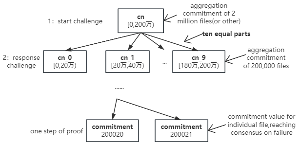

# Meeda详细描述

本文从开发者的角度详细讲解Meeda的整体交互流程，供开发者探讨交流。

## 上传文件

Rollup上传交易数据，Meeda会根据交易数据生成KZG多项式承诺`Commitment`，该值不仅可以唯一识别区块交易数据，也用于后续验证数据可用性证明的正确性。承诺值占用96字节，在合约中用`bytes32[4]`格式表示。之后Meeda会将交易数据的承诺值和元数据信息上传至以太坊等区块链进行持久化保存，从而保证获取数据的索引公开可访问。
交易数据会被分割成多个切片，通过纠删码或多备份技术进行数据冗余，使得节点作恶成本大大增加。

## 下载文件

任意节点根据交易数据的承诺值可以轻松访问交易数据，在Meeda的数据可用性保障性下，轻节点将无需下载所有数据即可验证数据的可用性。

## 生成验证信息

根据kzg多项式承诺方案以及去中心化特性，将由合约定期生成一个伪随机数`rnd`，用来对存储节点发起挑战，`rnd`将会确定抽样的样本。存储节点针对被抽样的文件生成数据可用性证明。
Meeda的验证合约将保证该伪随机数无法被预测，并且只会在特定的短时期内生成，从而避免存储节点利用时间漏洞造假从而躲避惩罚。
存储节点需要在确定的短时期内提交证明，超过了有效时期还未提交证明，则视为挑战失败，从而受到惩罚，并且还会触发数据修复。
根据伪随机数，确定抽样的待挑战文件，保证挑选的文件具有随机性、不可预测性。
Meeda的抽样验证是一种自适应验证方式。它对新区块（例如最近 10 个 epoch 中的区块）进行全量挑战，并对旧区块进行抽样挑战。 DA需要百分百保证交易数据是可获得的，因此，对于未最终确认的交易数据，Meeda会进行全量挑战，以百分百保证数据的可用性。对于较旧的数据，Meeda使用抽样挑战。我们假设数据故障率为1/1000，也就是说1000个文件中只有1个是故障的（对于存储来说，这种级别的作恶是没有利润的，假设100GB的数据，邪恶节点只存储99.9GB的数据，这样对于他来说，风险是大于收益的，所以1/1000的故障率几乎是最低的故障率），那么挑战m次始终找不到错误数据的概率为(1-1/1000)^m，则发现故障数据的概率为1-(1-1/1000)^m。我们假设故障发现率为99.99%，也就是说可以99.99%的确定性发现故障，那么可以得到m约等于9205.7，我们假设每次抽样挑战1万个数据块，这样就能大于99.99%的概率发现故障数据。这种自适应的抽样检查，使得我们能够100%保证最近提交交易的数据可用性，大于99.99%的概率保证历史交易的数据可用性。

## 生成证明并提交

存储节点在链下生成待验证文件的数据持有证明，聚合这些证明，将聚合证明提交到链上。
Meeda的验证合约假设证明是正确的，在证明被提交至验证合约时，合约不会立刻进行验证，当轻节点发起挑战时，验证合约才会对证明进行验证，从而减小验证开销、降低数据可用性的成本。

## 多轮交互式乐观验证

存储节点提交证明后，为了减少证明的代价，采用了多轮交互式的乐观验证方式。轻节点在链下对聚合承诺值和聚合证明值进行验证，如果发现错误，则可以针对该证明进行挑战。
如果是针对聚合承诺值的挑战，Meeda将采取多轮交互式验证。为了降低验证计算的成本，我们将聚合承诺值等分成十份，每次挑战，质疑者选中其中一份进行挑战，合约只需要进行十次聚合域计算，若被质疑的部分经过合约计算证明是正确的，那么质疑者失败，会被罚没押金；若通过合约计算，发现被质疑的聚合部分确实是存在错误信息，那么质疑者就需要再次把质疑的部分十等份，选中一份发起挑战，直至最终确定到非聚合的错误承诺值，质疑者和验证合约都对故障数据达成了共识，质疑者将获得奖励，导致数据故障的存储节点将接受惩罚。

## 总结

Meeda通过kzg多项式承诺技术、椭圆曲线计算、数据可用性抽样、纠删码多备份冗余机制、链上验证等技术保障数据的可用性，为以太坊Layer2，尤其是Optimistic类的Rollups，提供了一种安全可靠、低成本的DA解决方案。
