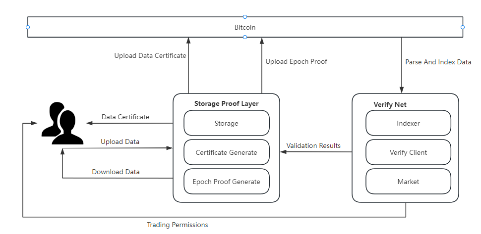
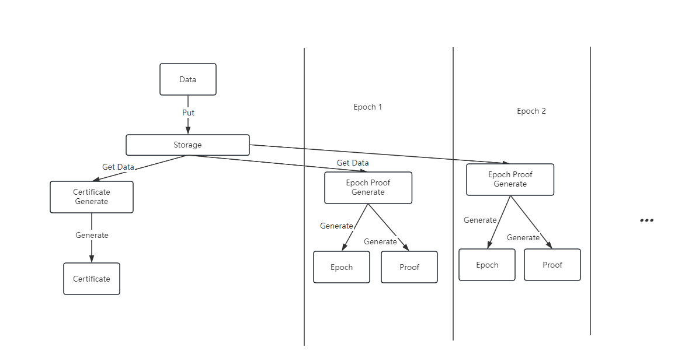
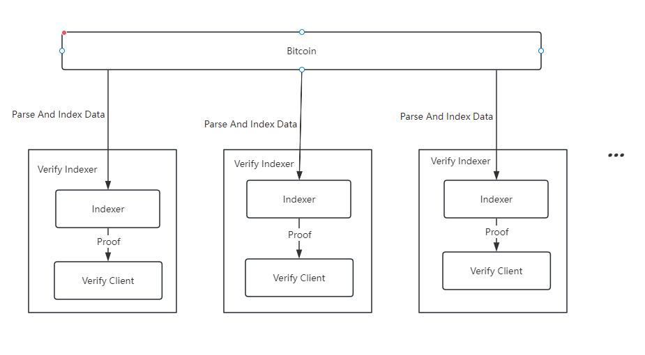

# mooda

## 介绍

区块链技术由于其安全、去中心化、透明的特性，持续吸引着金融和科技领域的目光，比特币作为其中的翘楚，最近也取得了重要的进步。随着见证隔离SegWit和Taproot升级，比特币的存储空间得到扩展，从而出现了序数协议和铭文等应用，这些应用方便用户将数据存储于比特币中。但是这些应用的出现只是稍微缓解了比特币生态对于存储需求的压力，因此生态提出了扩容方案——使用链下的数据可用层作为比特币扩容的解决方案。

Mooda （Memo Bitcoin Ordinals Data Availability）是一个基于比特币的持续可验证的数据可用层，以在不牺牲安全性的情况下提高比特币的存储效率，降低存储成本。Mooda提供了一个完善的可持续验证的数据可用层，从而为比特币生态及应用提供存储服务， 使用Mefs（Memolabs的分散式存储系统）提供存储服务，使用比特币区块存储验证信息，通过线下的索引器完成整个系统的验证和状态变更。Mooda的目标是为比特币生态用户提供一个低门槛、低成本、高效率、高安全的数据可用层。

## 铭文系统

### 铭文

因为比特币空间大小的限制，导致比特币上的数字收藏品生态一直不温不火，直到比特币经过见证隔离SegWit和Tarpoot升级后，用户已经可以在每笔交易中写入4MB大小的内容，此时比特币的技术和空间对于数字藏品应用都已经足够，因此基于比特币的数字资产铭文应运而生，让比特币不再局限于金融行业。

铭文是一段采用序数协议（ordinals）铭刻（inscribe）在聪（比特币的最小计账单位）上的数据。在比特币区块链的背景下，铭文的出现使得用户可以将4MB以下任何形式的内容铭刻到指定聪上，由比特币区块进行持久化存储。铭文的出现为比特币生态带来了新的功能和应用场景，尤其是在数据存储和非同质化代币（NFT）等领域。

序数协议是一种对聪进行编号的方案，能够对单个聪进行跟踪和转移。编号的方案取决于开采聪的顺序，转移方案取决于交易输入和输出的顺序。序数协议可以将任何形式的内容作为稳定的标识符附加到聪上。

由于Taproot脚本只能从现有的Taproot输出中使用，所以铭文通过提交和揭示两个阶段来实现铭文内容的展示，这两个阶段的过程就被称作为铭刻。

### 索引器

尽管铭文技术为比特币生态带来了创新的发展机遇，但是比特币的脚本语言仍然存在局限性：无法直接处理复杂的逻辑和程序。为了克服这一图灵不完备性的挑战，生态用户引入了比特币索引器的概念。索引器作为一种补充解决方案，使得比特币能够间接处理更复杂的逻辑，从而扩展了其功能并增强了其在现代区块链应用中的适用性。通过这种方式，比特币索引器为比特币网络解锁了新的潜力，推动了其在金融科技和其他领域的进一步发展。

索引器通过检索比特币的区块和交易数据，获取铭刻于区块中的数据，结合线下的存储层构建出图灵完备的系统。

索引器包含以下几个功能：

1. 检索链上数据（找出铭刻于聪上的数据）
2. 筛选链上数据，确定状态，确定数据归属（谁上传的）

### BRC721

BRC-721是一个基于比特币实现非同质化代币（NFT）的协议 ，通过设计特定格式规范的铭文，从而实现代币的部署、铸造、转移、更新等操作，为在比特币区块链上实现非同质化代币提供了一种解决方案。

BRC-721通过第三方存储保证数据的可用性，主要服务于数字资产等轻量级的存储应用，不适用于用户需要进行大量数据存储的应用。此外，使用ipfs作为存储方案也会遇到数据可靠性以及数据安全的问题。

## 问题

将数据直接存储到比特币区块链上，虽然获得了不可篡改和持久化的特性，但是也存在一些显著的缺陷和挑战：

1. 链上存储需要支付交易费用，每次数据的读写都需要作为交易被添加到区块链上，对于大量数据，这些费用可能会变得非常昂贵。某匿名钱包花费1.5个比特币（价值约66000美元）铭刻了近9MB的数据。
2. 区块链网络通常有着严格的数据限制，每个区块的存储数量有限，尽管比特币经过了Taproot升级，将单笔交易中可写入的数据从80字节的限制提升到了大约4MB，但是仍然不能满足网络中日益增长的存储需求。
3. 随着区块链网络的增长，链上数据的增加可能会导致网络拥堵，降低交易处理速度，随着铭文的火爆，比特币链网络中常常出现一个铭文将整个区块占满的情况，影响其他交易数据的打包。
4. 区块链网络的数据通常是公开的，意味着任何人都能查看存储到链上的信息，这可能会引发隐私泄露的风险。

为了解决比特币中的上述问题，生态参与者提出了数据可用层的概念。

## 数据可以层

数据可用层（Data Availability Layer）是用来解决区块链网络中数据存储和可访问性问题的新兴方案，它可以确保所有的网络参与者都能快速且容易的访问到用户数据和其他信息。

数据可用层具有以下特点：

1. 通过将数据存储任务从链上分离出来，有助于减轻链上负担，提高整个网络的处理速度和效率。
2. 可以提供数据验证机制，确保数据的准确性和完整性。
3. 可以通过在存储层添加权限控制，保障用户的数据安全以及隐私性需求。
4. 数据存储通常采用分布式存储，有助于保持整个网络的去中心化特性。
5. 兼容性强可以支持多个区块链网络。

## 解决方案

针对链上数据存储的问题，下文将分开讲述当前的解决方案以及Mooda解决方案。

### BTC解决方案

BTC目前出现了Nubit和B2 等比特币区块链扩容的方案。

Nubit采用模块化的索引器和数据可用层的结合，委员会（committee）索引器根据链上数据计算出检查点，然后将检查点存放于数据可用层中，普通索引器返回查询结果和相应的证明，轻量索引器由用户运行，从普通索引器中获取相应的证明，使用检查点来验证结果的正确性。通过这种方式将整个状态的完整性检查简化为检查少量检查点的有效性。

B2 网络构建了一个比特币的第二层解决方案，B2网络分为汇总层和数据可用层，通过它的数据可用层作为整个B2网络的存储和验证层，由三部分组成：去中心化存储、比特币网络和B2 节点。去中心化存储从Rollup层获取Rollup数据并存储，定期根据存储汇总的时间和空间生成零知识证明，将存储证明发送给B2 节点，B2 节点充当链下验证者，用以验证证明的正确性。比特币网络作为B2 网络的最终结算层，B2汇总数据存储于比特币上，根据比特币上的B2铭文确认B2的交易数据。

### 现有解决方案

Nubit的方案的侧重点在于Indexer，为了解决Indexer的可信问题，从而构建一个数据可用层存储验证点，在有committee索引器作恶时，用户运行的轻量索引器就需要通过之前的检查点使用无状态计算恢复出原有数据，同时将检查点放在线下存储，降低了系统的安全性。

\( B^2 \)的方案需要运行\( B^2 \)节点，同时作为比特币的第二层方案，存储质押需要使用\( B^2 \)网络的代币BSQ，\( B^2 \)网络的交易和证明信息汇总存放于数据可用层中，然后汇总将证明提交到比特币区块，但缺乏可持续的验证，不能保证数据可用层中数据的完整性和可用性。

### Mooda解决方案

Mooda将实现一个基于比特币的可持续验证的数据可用层，通过持续的生成存储证明，向用户表明数据的可用性。通过将存储证明放在比特币链上，保障了证明的公开透明，使得验证环节可以去中心化，保障了系统安全性和可靠性

Mooda通过三个部分存储证明层、比特币区块和验证网络来实现数据的可持续验证，表明数据的可用性，用户将数据提交到存储验证层，存储验证层将数据存储于线下的去中心存储中，并且为数据生成存储凭证返回给用户，同时将存储凭证提交到比特币链上，之后将会周期性的提交周期证明到比特币链上，验证网络同步比特币区块链中的消息与状态，验证证明的正确性，确认数据的归属，同时提供市场服务方便用户交易数据权限。

#### 存储证明层

存储证明层主要负责处理两部分事务，即数据存储和数据证明。

**数据存储**为用户提供上传、下载、列表等服务，方便用户操作数据。在用户数据的存储周期内，尽可能的保障数据的安全性。

**数据证明**为经过数据存储事务的数据生成凭证信息和持续性的证明信息，向用户表明数据的存储信息，同时在用户的存储周期内持续的向用户证明数据安全且没有被篡改。

存储证明层主要由存储数据、凭证生成、周期证明生成这三个功能：

- 存储

**存储**顾名思义就是数据的存放的地方，负责实现存储验证层中数据存储这部分事务，为了保障数据的安全性，采用了冗余备份的方式存储数据，在数据出现问题时，能够及时修复数据。

为了避免单点故障风险和提高存储的可靠性和可用性，同时也为了降低存储使用成本，存储采用去中心化的存储网络Mefs作为数据存储的底层。

- 凭证生成
为了解决数据的所有权和确认数据已经存储于系统中的问题，凭证生成会为每个上传成功的数据生成一个数据凭证，用来表明数据存放的位置、存放的周期以及数据的所有者。

**凭证**中包含数据的哈希值、数据的有效期、数据存放的链接、数据的周期以及数据所有者的信息。凭证是数据进入验证系统的门槛，整个系统只验证凭证在有效期内的数据，没有数据凭证或者数据凭证过期的数据将不会被验证。

- 周期证明生成

为了持续向数据所用者证明存储中数据的可用性和完整性，会周期性的生成周期信息和证明信息，周期信息包含数据验证的范围，证明信息可用于检验数据的完整性，两种信息组合起来即可表明在这个周期内数据完好的存放于存储中。

为防止存储提前生成所有的周期证明，在生成周期证明的时候引入一个随机数，这个随机数由周期链上信息和前一个周期证明的链上信息组合生成，保证了在证明无法提前被生成，从而避免存储证明层不存数据也能生成正确的周期证明

#### 验证网络

由于比特币是图灵不完善的，所以存储于比特币链上验证消息，无法在比特币链上进行验证，所以需要一个线下的验证器来完成验证信息是否正确。同时想要获取比特币链上的消息和状态 ，需要用一个线下索引器进行处理，这两个部分共同组成一个验证索引器。多个互相独立的验证索引器共同组成验证网络

**索引器**通过同步比特币链上的交易信息，寻找写在见证隔离中的数据，筛选出有存储验证层生成数据凭证且在有效期内的数据的验证信息，存储数据的状态变更信息，并将数据按周期分组。

**验证器**在每个周期内，对本周期内的数据证明进行验证，确认证明是否正确，用以确认这个周期内数据是否被安全完整的存储在存储证明层中，如果验证失败则会发起挑战，来确定是存储验证层的错误，还是验证器的错误，如果是存储验证层的错误则触发修复流程，未能修复时则进行处罚，如果是验证器恶意挑战，则对验证器进行处罚。

#### 比特币上的铭文

因为比特币不具备索引数据的能力，所以想要获取存储于比特币上的信息时，需要同步比特币上的所有数据，从中筛选出符合要求的信息。而现有的铭文系统完全能满足上述要求，所以选择了铭文作为链上信息的载体。同时铭文的状态也能为控制数据的权限提供支持。

Mooda将数据的凭证、证明、周期等信息以铭文的形式存储比特币区块链上，从而让这些信息能够在特币区块链上持久化存储，同时验证网络中也可以直接铭文中筛选数据，减少了索引数据的工作量。

Mooda 的铭文分为三类：

- 数据凭证铭文
数据凭证铭文包含数据哈希值、存储签名、存储时间，所在周期等内容，向用户展示存储提供者，存储时间，以及数据的链接。在权限控制方面只有持有数据凭证铭文的用户才是数据的拥有者，能够对数据进行任何操作。

- 周期铭文
周期铭文包含时间信息，是整个持续验证系统的尺度，用于让验证网络确认所需验证的数据的范围，同时作为随机数生成的一部分，使得存储证明的生成不能被预测。

- 数据证明铭文
数据证明铭文包含根据数据生成的证明，用以表明在这个周期内，存储完整的保存了该数据，同时铭文的所有者要与存储凭证中的存储签名相匹配，防止受到包含错误证明的恶意铭文的攻击，造成验证系统的混乱。

## 技术亮点

**持续验证**：通过持续不断的数据验证，我们可以向用户展示他们存储的数据的完整性。为了更明确验证的范围，我们引入了周期的概念。周期是一段时间，在此期间我们将验证用户数据的完整性。为了确保每次验证都是不可预测的，我们将上一次周期的证明信息与链上的信息组合起来生成新的周期证明。

**线上验证**：将验证信息存放在链上，可以保证验证信息的公开透明以及去中心化，使得线下的验证网络中的验证节点可以在任何地方，任何地点的验证证明的正确性，从而更好的保证数据的安全和可用性。

**方便快捷**：依托于现有的比特币铭文，降低了用户的使用门槛，用户可以方便快捷的使用整个系统进行存储服务。

**安全可靠**：基于零知识证明的验证能够让验证者无需获得整个数据就能确认数据的完整性，减轻了验证者的负担，同时权限控制也能满足对数据隐私性有需求的用户。
