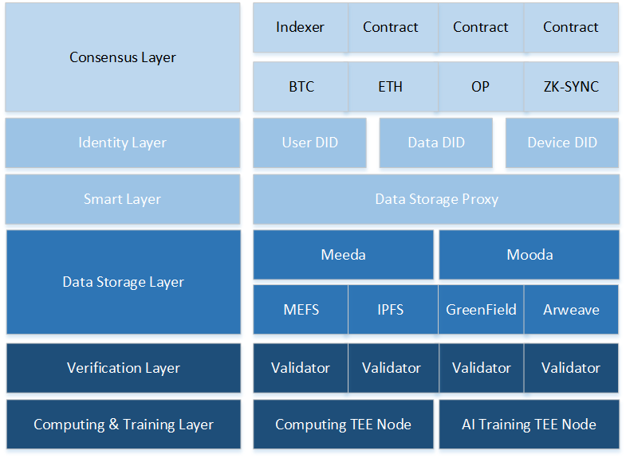

## MEMO Protocol

MEMO协议共分为六层，能够在数据生命周期内保证数据安全和隐私，使用户能够在各个去中心化应用中使用、共享其数据并享受数据带来的价值。

- **执行层**：MEMO的执行层是MEMO网络中的关键组成部分，负责处理交易和智能合约的执行。它确保区块链系统中交易的有效性和一致性，并与数据可用性层协同工作，提供所需的数据存取与验证。
- **身份层**：MEMO的身份层是 MEMO 去中心化生态系统中的关键部分，旨在通过提供安全、高效和跨平台的数字身份解决方案来支持用户数据主权和应用互操作性。
- **智能层**：MEMO的智能层专注于为现代互联网应用提供分布式、高效、自驱动、低成本的数据托管服务。支持Web 2.0应用平滑迁移到Web 3.0，同时为新兴的Web 3.0应用提供强大的基础设施支持。
- **数据存储层**：MEMO的数据存储层提供高度灵活且可扩展的数据存储方案，用户可根据数据的重要性选择不同的数据存储方案，确保数据存储安全性。
- **计算层**：MEMO的计算层采用了可信执行环境（TEE），确保个人数据在私密且高安全的环境中执行计算，并在计算完成后发布TEE证明到链上，保证了数据隐私以及数据安全。
- **验证层**：MEMO的验证层旨在确保各层均能去中心化、安全且正常的运行中起着至关重要的作用。任何人均可以成为验证者并为MEMO协议的运行提供保障，验证者的工作包括验证TEE证明，验证DA证明等。