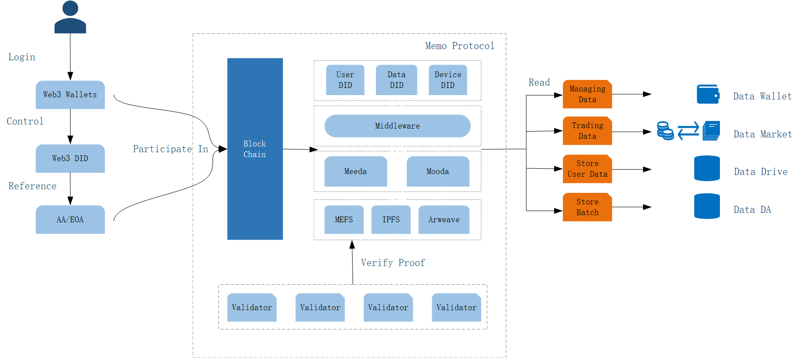

# Introduction MEMO

As the Internet enters the era of data explosion, data storage, privacy protection and assetization have become key challenges. Traditional data storage methods face frequent system failures, lack of privacy protection, and complex and opaque data assetization processes. In the rapid development of blockchain technology, the concept of modular data layer provides a key idea to solve these problems.

As a modular data layer based on blockchain, MEMO has the following characteristics:

Solving the limitations of traditional storage

Current centralized storage methods (such as traditional cloud storage) are susceptible to single point failures and privacy leaks. MEMO's modular design separates data storage, processing and access, builds a more flexible and decentralized storage architecture, and improves the security and reliability of data storage.

Improving the scalability of blockchain

Blockchain systems often encounter performance bottlenecks when facing massive amounts of data. MEMO separates storage functions from execution and consensus layers through a modular data layer architecture. This design reduces the burden on blockchain nodes and improves the system's throughput, enabling it to better support high-frequency trading scenarios and complex applications.

Promoting data assetization and transparency

Data assetization is an important trend in the future digital economy, but the process under the traditional model often lacks transparency and users have insufficient control over data. MEMO uses the traceability and transparency of blockchain to give users control over data use and sharing, while simplifying the process of data assetization.

Building infrastructure for Web3

The modular data layer is an important part of building Web3 infrastructure. MEMO's modular architecture enables seamless integration with other blockchains or applications, supports cross-chain interoperability, and provides developers with flexible tools to build decentralized applications.

In order to realize the above vision, MEMO has built an ecosystem consisting of MEMO Protocol, launched the MEFS decentralized storage system, provided two data availability solutions, Meeda and Mooda, developed two chain-based online disks, EthDrive and LensDrive, and launched data wallets, data trading markets, and decentralized computing power leasing platforms.

MEMO Protocol

MEMO Protocol is a modular data layer that can promote data storage, data management and data assetization of blockchain + AI. It covers decentralized data storage, on-chain data storage verification, decentralized identity, 100% user management of data, and easy data assetization. Through the MEMO protocol, users can control their own data as never before, and the flexibility and scalability of blockchain systems can be improved.

MEFS

MEFS is the first decentralized storage system based on blockchain, using idle edge storage devices to provide users with low-cost, privacy-protected, and highly reliable storage services.

Meeda

Meeda (the first two letters of MEMO, the first letter of Ethereum and the abbreviation DA for data availability) is a data availability solution for the Ethereum ecosystem, providing low-cost, highly secure data storage and proof services for Ethereum Layer2.

DataDrive

MEMO's DataDrive includes Drive3, EthDrive, and LensDrive, which are designed to provide high security, high capacity, and user-friendly features for Web3 applications. It is built on MEMO's decentralized storage system MEFS, using blockchain technology to ensure data privacy, reliability, and user ownership. LensDrive is designed for the Lens decentralized social ecosystem. It combines file backup, preview, sharing and other functions to provide Web3 users with secure, private, and efficient data storage services. Drive3 and EthDrive have more universal applicability.

Data Wallet

Data Wallet is an innovative Web3 tool that aims to combine data storage and management with blockchain technology. It uses the MEMO decentralized storage system to provide users with a secure and reliable data storage environment while giving users full control over their data. Through encryption and smart contract technology, users can easily access data, interact across chains, and ensure privacy. In addition, Data Wallet also supports treating data as assets, enabling convenient data transfer and transparent management, and providing core support for decentralized applications in the Web3 ecosystem.

Data Market

The Data Market aims to build a decentralized platform that focuses on the secure exchange and assetization of data. This market is based on blockchain technology and uses distributed storage and smart contract mechanisms to achieve efficient data transfer and transparent transactions. It eliminates high intermediary fees and provides creators and consumers with a fairer and more open data asset trading platform.

Decentralized Computing Power Leasing Platform (GRID)

GRID is a decentralized computing power leasing platform that aims to solve the problem of imbalance between supply and demand of computing resources. It uses blockchain technology to build an open market that allows users to rent out idle computing resources, while providing a flexible, efficient and transparent solution for users who need high-performance computing (such as AI model training, data analysis and scientific computing).
