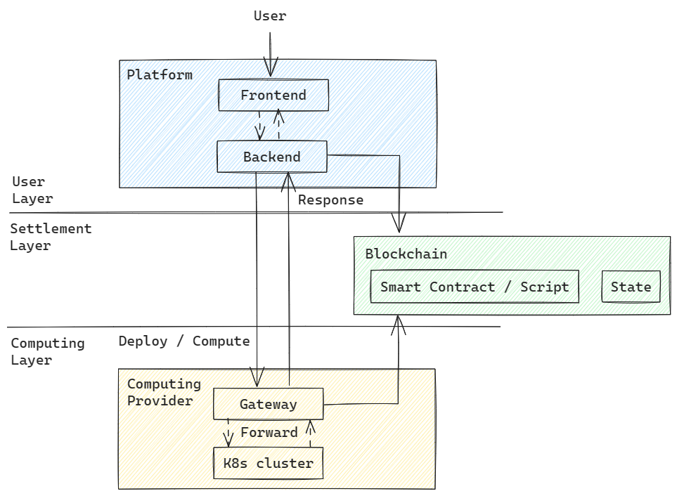

# GRID - Data-Trading-Market

## Introduction

GRID is a comprehensive system that provides a trading marketplace for computing nodes and users, enabling automated settlement of service fees. It allows computing nodes to utilize the GRID gateway for order verification, application deployment, and other functionalities, while registering their resource information for users to select and utilize.

Nodes need to deploy a local service cluster (such as Kubernetes) to integrate their local computing resources. Then, they start the gateway service locally and register their node resource information through the platform's node registration functionality. The platform presents the registered nodes to users, who can choose suitable nodes to provide services according to their needs.

Users can select nodes that meet their requirements from the platform, create orders with the nodes, and make corresponding payments. Afterward, they can start using the node resources and deploy specific applications through the gateway API. Once the application is successfully deployed, users can access the deployed application services directly by accessing the node gateway.

## Roles in GRID

Provier is a node with computing resources and willing to serve users to gain profit.

User is the consumer of computing resources, and the amount of tokens paid to providers is according to the number of resources and the duration of the order accepted by a provider.

### Provider

The computing nodes serve as the suppliers of computational power in the computing marketplace. They utilize container orchestration software to organize existing hardware resources, including processors, memory, storage, and graphics cards. Subsequently, they start the gateway service to provide various API interfaces externally, enabling node functionalities such as identity authentication, application deployment, and application access.

During application deployment, the resource description file is downloaded from the provided YAML file URL in the deployment request. The node then interacts with the container orchestration software to deploy the application described in the resource description file to the local environment, thereby completing the provision of computational power services.

After deploying the local infrastructure and starting the gateway service, the computing nodes also need to register their node information on the blockchain through the GRID platform service. This allows for the public exposure of the nodes. User nodes can access all registered computing nodes through the API interfaces provided by the platform.

### User

As a user, you act as a consumer of computational power. To begin, you need to purchase tokens used for paying for computational services. Based on the availability of resources and their prices, you can choose the most suitable computing node to create an order with and make the corresponding payment according to the market rate. Once the order is activated, you can start deploying applications on the computing node to actually utilize the purchased computational resources.

The token payment made by the user for the order will be settled based on the actual duration of service provided to the user. The calculated fee amount will be paid to the computing node upon completion or cancellation of the order. Any remaining amount will be refunded to the user.

## Design

The architechture is constructed by 3 layers:



### User Layer

The user layer is made up of the frontend and the backend, it is responsible for offering most of the operating APIs for all kind of nodes, including user nodes and provider nodes.
The frontend works as a webui, it provides a web based user interface to interact with users, and sends corresponding requests to backend on behalf of users.

The backend deals with all the requests sent by users on the frontend, and when all the jobs are done, the response will be sent back to the frontend to show the results.

### Settlement Layer

The settlement layer mainly contains several smart contracts on blockchain, inculding the register contract, the market contract, the erc20 contract.

The register contract is used to manage all prvoders' infomation, including resources and prices and other basic infomation.

The market contract is used to manage all orders created between users and providers. Except recording all the orders, it completes the settlement task which is the core function of the market cotract. The settlement procedure calculates the amount of credit left in the order which should be refound to users, and the amount of credit the providers can get from this order, and pay to both of them.

### Computing Layer

The computing layer works on providers. It contains 2 parts, the gateway and the k8s cluster on providers.
The gateway is a daemon application running by providers, dealing with the greeting and the computing requests. It interact with the local k8s cluster to achieve the app management, such as app deploying, visiting, and deleting.

The k8s cluster is used to integrate all computing resources, and run user's application images in containers automatively.

## Architechture

### Block Chain in GRID

GRID use some smart contract running on block chain to achieve the settlement functionalilty.

Block Chain

The blockchain is a decentralized distributed ledger that combines technologies such as distributed storage, peer-to-peer transmission, consensus mechanisms, and cryptography. In the blockchain, data is secured and trusted through encryption algorithms and consensus mechanisms. Each node maintains a complete copy of the entire system and participates in data verification and updates. The blockchain records transaction information by creating data blocks (blocks). Each block contains a certain number of transaction data and the hash value of the previous block, forming a growing chain. This structure ensures that once data is recorded, it becomes difficult to tamper with, providing transparency and traceability of transaction history. As a result, blockchain technology is widely used in digital information storage, identity verification, smart contract execution, asset management, and other fields.

In the GRID project, blockchain and smart contracts running on the blockchain are used to facilitate the registration of computing power nodes, storage of user-node service orders, and automatic fee settlement. The entire settlement process is automated by the contract code without human intervention, ensuring transparency and security in the order payment process.

Contracts

The node contract is used to record the registration information of nodes (CP).

The market contract is used to manage the information of orders created by users, and complete the settlement operations.

The erc20 contract is used to manage erc20 token of all accounts.

### Gateway

What is the GRID gateway?

The GRID gateway is a daemon program run by computing nodes responsible for providing core services to implement project functionalities, including the greet service and process service.

Greet Service:

It handles order verification and application deployment. The GRID gateway is deployed on each resource node (CP) to receive user requests and perform tasks related to the local Kubernetes cluster of the node. This enables the deployment of user applications to the node's Kubernetes cluster.

Process Service:

It forwards user requests to the Kubernetes computational cluster deployed on the computing node and returns the response data from the user's application back to the frontend for display.

1 Authorization

Type 2 request of the Greet interface: User identity verification and cookie issuance

After the validation of the order payee is successful, the user needs to sign the request to prove their identity. Once the verification is successful, an authorization cookie is issued to the user. Upon receiving the cookie, the user can proceed with application deployment and usage.

2 App Deployment

Once the previous validation steps have been completed and the authorization token (cookie) has been obtained, the application deployment functionality of the gateway can be used.

In the deployment request, it is necessary to provide the YAML file URL corresponding to the application to determine the image information to be used by the application. The deployment functionality will download and parse the YAML file, deploy the application described in the YAML file, and generate a corresponding service for the application after successful deployment. Finally, the service will be registered in the corresponding application entry point for the user. The entry point will be obtained in the forwarding functionality and used as the target URL for request forwarding by the reverse proxy.

3 Request Forward

The GRID gateway does not directly handle user application access requests. Instead, it forwards user requests to the application entry point (entrance) through the reverse proxy provided by the gateway and retrieves the response.

The process is as follows:

The gateway receives a Process request.

It retrieves the application entrance address registered by the user during application deployment.

The gateway uses the reverse proxy to forward the incoming request to the application's entrance point and retrieves the application's response.

Finally, the reverse proxy returns the response data obtained from the request to the frontend, completing the forwarding process.

### Infrastruct on provider

Providers must prepare some local environment to become available.

1 Provider Infrastructure

The provider deploys Kubernetes container orchestration software. The provider is responsible for planning the number of nodes to deploy based on its available resources and adding these nodes to the Kubernetes cluster. The applications deployed by users will run on these nodes, and the provider must ensure that all local nodes are functioning properly to ensure the smooth operation of user applications.

2 Kubernetes

In the GRID project, resource nodes (CP) integrate their resources through a Kubernetes (often abbreviated as K8s) cluster.

Here is a basic introduction to Kubernetes:

Kubernetes is an open-source container orchestration platform used to automate the deployment, scaling, and management of containerized applications. It provides a highly scalable cluster management solution that can run on cloud or on-premises infrastructure.

The design goal of Kubernetes is to simplify the deployment and management of containerized applications. It offers a powerful platform that automates tasks such as container scheduling, scaling, storage management, networking, and application health monitoring. Kubernetes also provides rich features such as service discovery, load balancing, key management, and configuration management to help developers build and manage reliable distributed applications.

Kubernetes organizes the deployment units of applications using a set of containers called "Pods." Pods are a group of containers that share the same namespace, allowing them to share network and storage resources and communicate through a high-speed local network. Kubernetes also provides a robust scheduler that deploys Pods to nodes in the cluster based on resource requirements, health status, and other policies.

In addition to the basic container orchestration capabilities, Kubernetes supports Custom Resource Definitions (CRDs) and controller extension mechanisms, allowing users to customize and extend the behavior of Kubernetes. This makes Kubernetes a highly customizable and scalable platform suitable for various application scenarios of different scales and types.

In summary, Kubernetes is a popular container orchestration platform widely used for building, deploying, and managing containerized applications. It helps users achieve highly automated, elastic, and reliable application deployment and operations.

3 YAML

In Kubernetes (K8s), YAML files are commonly used to define and configure Kubernetes resources. They are text files written using the YAML (YAML Ain't Markup Language) syntax. By writing appropriate YAML files, various Kubernetes resources such as Deployments, Services, ConfigMaps, PersistentVolumeClaims, and more can be created, deployed, and managed.

In a YAML file, we can specify the API version, type, metadata, and specification of Kubernetes resources.

Here's an example of a YAML file:

```json
apiVersion: apps/v1

kind: Deployment

metadata:

name: my-deployment

spec:

replicas: 3

selector:

matchLabels:

app: my-app

template:

metadata:

labels:

app: my-app

spec:

containers:

\- name: my-container

image: my-image:latest

ports:

\- containerPort: 8080
```

In the example, we define a Deployment named "my-deployment" that will create three replicas. The replicas are associated with Pods using a label selector that matches Pods with the label "app: my-app." The template section of the Deployment defines the specification of the Pods to be deployed, including the image, ports, and other details of the containers.

By using YAML files, we can achieve declarative configuration, which means describing the desired state of Kubernetes resources by defining the desired state and specifications. The Kubernetes controller is responsible for ensuring that the actual state of the cluster aligns with the desired state.

Using YAML files makes it easy to create, update, and delete Kubernetes resources, enabling automated deployment and management of applications. Additionally, YAML files provide a highly readable format, simplifying the configuration and sharing of Kubernetes resources in a reliable manner.

### Platform

The GRID platform provides interfaces for various common services to cater to different users. These services include computing node registration, order creation, token transfers, ERC20 deposits, and other functionalities.

1 Provider Register/List

The purpose of registering their resource information in the contract is for computing nodes to make their resources known to user nodes. Only registered computing nodes can be discovered by user nodes and provide computing service for users.

2 Order Creation

It is used for users to create service orders with selected nodes based on their resource requirements and pay the corresponding fees for the orders.

3 Token Transfer

Users make actual payments using tokens through token transfers. Once the token transfer is successful, users can convert the tokens into credits by depositing them into their credits account. The credits are then used to pay for order fees.

4 Credit Purchase

Users use token transfer records to recharge an equivalent amount of credits. These credits can be used to purchase orders. The cost of each order is calculated based on the quantity of ordered resources, the resource unit price provided by the node, and the duration of the order's service. The payment for the order is made using credits.

5 Credit Query

Querying the current balance of a user's credit account.

6 TX Confirmation

The transfer of token transactions (transfer) is an on-chain action, and the confirmation of transactions on the blockchain requires some time. The refresh interface is used to verify if the transfer transaction has been completed and to update the confirmation status of the transfer to true.
