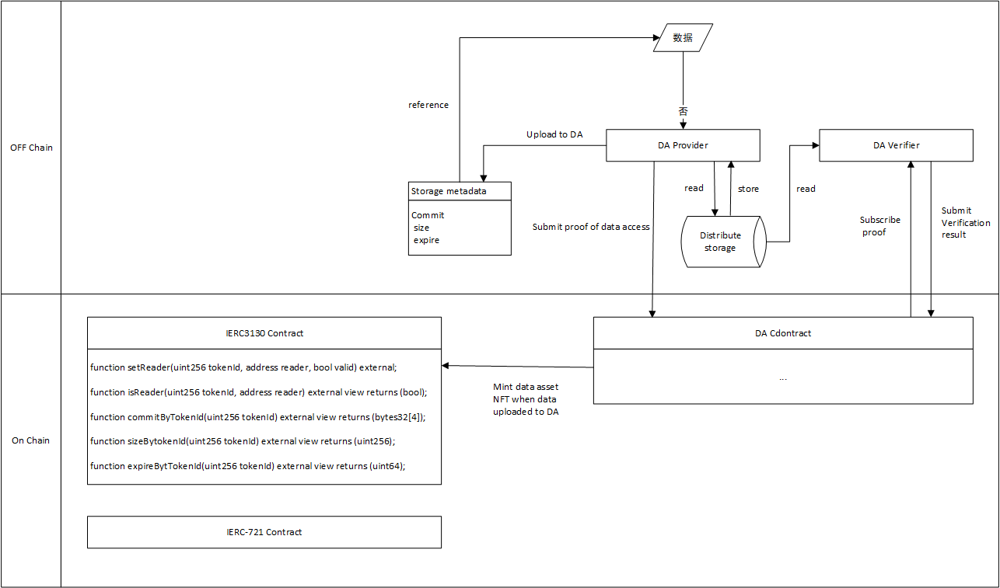

## Abstract

本提案是对ERC-721的扩展。本提案新添加了Reader的角色，Reader由Owner授予且一个NFT同时拥有多个Reader。此外，本提案扩展了ERC-721的元数据接口，明确规定将元数据信息应至少包括承诺，大小，有效期以及上传者地址。同时采用存储证明的机制，确保元数据信息的正确性。

## Motivation

ERC-721提出使用NFT来表示数字或实物资产的所有权。目前，NFT的元数据被视为NFT的实际内容，其稀缺性往往决定了NFT的价值，并且NFT所有者通过转让NFT的所有权可以将NFT的内容价值转换成收益。然而，由于昂贵的交易费，存储费用以及其他费用，导致目前NFT仅能代表高价值资产的所有权，这限制了NFT可代表的资产范围。特别是对于数据资产而言，数据资产的内容价值差异较大。

此外，为了降低存储费用，NFT的实际内容往往存在链下（IPFS，S3）或者跨链存储（Arweave），并采用链接的方式保存在链上。链下用户可以通过访问该链接获取到NFT的实际内容。然而链上合约无法访问链接判断数据的状态，例如数据丢失，数据被篡改或者数据过期。这些情况将导致数据已偏离其实际价值，但链上NFT任然存在，并且基础版权依然在市场中售卖。

本提案提出了data asset NFT，通过结合模块化存储层DA（Data Access）解决了链上数据资产的困境。

## Specification

### Terms

在本标准中，我们将数据资产划分为三部分：

- 存储元数据：包括承诺，大小，有效期以及上传者地址。由区块链上存储合约保存和维护。
- 权限元数据：包括所有权和读取权的信息，以及规定哪些地址可以修改这些信息。由区块链上权限合约保存和维护。
- 数据内容：用户上传至存储系统的数据。数据内容存储在链下存储节点中。

The keywords “MUST”, “MUST NOT”, “REQUIRED”, “SHALL”, “SHALL NOT”, “SHOULD”, “SHOULD NOT”, “RECOMMENDED”, “MAY” and “OPTIONAL” in this document are to be interpreted as described in RFC 2119.

### 数据权限合约接口

数据权限合约是对ERC-721的扩展，数据权限合约添加了reader角色，一份数据可以对应多个reader。

数据权限合约所需的接口如下：

```solidity
interface IERC3130 is IERC721 {
	event UpdateReader(uint256 indexed tokenId, address indexed reader, bool valiad);
	
	function setReader(uint256 tokenId, address reader, bool valiad) external;
	
	function isReader(uint256 tokenId, address reader) external view returns (bool);
	
	function commitByTokenId(uint256 tokenId) external view returns (bytes32[4]);
	
	function sizeByTokenId(uint256 tokenId) external view returns (uint256);
	
	function expireByTokenId(uint256 tokenId) external view returns (uint64);
}
```

data asset NFT的元数据模式如下：

```json
{
  "title": "Data Asset Metadata",
  "type": "object",
  "properties": {
    "name": {
      "type": "string",
      "description": "Identifies the asset to which this NFT represents"
    },
    "description": {
      "type": "string",
      "description": "Describes the asset to which this NFT represents"
    },
    "commit": {
      "type": "string",
      "description": "A commit pointing to the data resource"
    },
    "size": {
        "type": "integer",
        "description": "The size of the data resource"
    },
    "expire": {
        "type": "integer",
        "description": "The expire time of the data resource",
    }
}
```

Reader角色不应该涉及权限的变更，即Reader无法调用Transfer，Approve以及SetReader的功能。

当调用Transfer功能时，需要将approved address置为默认地址，默认地址设为0。但是保留全部的reader。

### 扩展：存储合约

本标准扩展了NFT的元数据信息，元数据信息由用户上传，上传过程需要相关的证书，证书可以是存储节点对于NFT的元数据信息的签名。本文档不限定元数据的格式，但NFT的元数据应该至少包括承诺，大小，有效期以及上传者地址。

由本提案的实施者选择可信的存储系统以及可信的存储节点，或者由本提案的实施者

当Owner或者Approved Operator调用transfer，approve或者setReader函数时，必须在调用前额外检查当前时间`block.timestamp`是否大于过期时间`expire`。若当前时间`block.timestamp`小于过期时间`expire`，则继续执行后续操作，若当前时间`block.timestamp`大于过期时间`expire`，则中断后续操作并返回异常信息。

### 扩展：存储证明

本标准采用存储证明证明数据内容的存在，从而证明NFT元数据的正确性，尤其是NFT的有效期`expire`。

本标准并不限定使用的证明方案，本标准建议使用KZG多项式承诺技术。KZG多项式承诺技术初始化时可以根据多项式证明技术生成两个生成元$g_1$以及$g_2$。并且会根据数据内容生成对应的承诺C，且在上传元数据时，作为数据的唯一标识符上传。生成证明时由验证者生成随机数$z$，证明者根据数据内容以及随机数$z$生成证明$P=(y, π)$，验证时验证$e(π, y*g_1-z*g_2) = e(C - y*g_1, g_2)$。

此外，KZG多项式承诺技术可以将多个证明聚合生成单一的证明，两步验证即可验证所有证明的正确性，包括加和所有的承诺得到承诺的聚合$C_n$，并在验证聚合证明$P_n=(y_n, π_n)$时验证$e(π_n, y_n*g_1-z*g_2) = e(C_n - y_n*g_1, g_2)$。

为避免生成证明时间过长，可以采用随机抽样的方法，随机选取要挑战的有效数据。因此，在合约中需要提供安全的伪随机生成函数，用于随机选择挑战的数据，同时也可作为KZG的随机数$z$。

在验证过程中，加和所有的承诺得到承诺的聚合需要耗费大量的gas fee。本标准建议采用乐观证明，即一直假设聚合的承诺是正确的，在验证时仅验证$e(π_n, y_n*g_1-z*g_2) = e(C_n - y_n*g_1, g_2)$。在验证聚合证明后，并不能证明数据的存在，需要设定一定时长的质疑期。在质疑期内，任何人均可以对承诺证明$C_n$质疑，质疑成功则质疑人获取奖励，证明者受到惩罚；质疑失败则质疑人受到惩罚，证明者获得额外收益。

## Rationale



数据资产类NFT目前最大的挑战在于数据内容的可见不可用：NFT的数据内容在建立访问控制权限后，即访问数据内容需要一定的访问权限时，没有数据访问权限的用户在获取访问权限时，如何确保数据内容是存在的？为了防止用户在不知情的情况下做出错误的操作，需要将数据内容的信息上传至链上，具体而言，需要将数据内容的有效期上传至链上。用户可以访问数据内容的有效期，从而判断其NFT是否有效，从而做出相应的决策。

当然，如何证明有效期的真实性又是另外一个问题。虽然存储节点承诺在数据有效期内一致保存数据，但在不信任的环境下，存储节点有可能在有效期内删除数据内容。因此，存储节点需要在数据有效期内，定期地提交数据的存储证明，以保证有效期的正确性。从而保证用户在不信任的环境下，能够获取访问受限的资源的基本信息。

## Backwards Compatibility

该提案结合了现有的 721 扩展，并向后兼容 ERC-721 标准。
