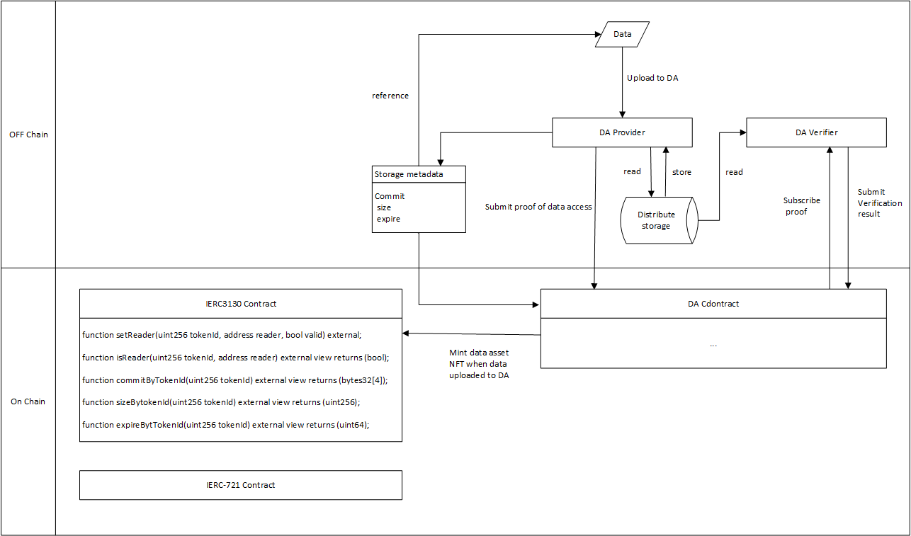

## Abstract

This proposal is an extension of ERC-721. This proposal introduces a new role called Reader, which is granted by the Owner and allows multiple Readers for a single NFT. Additionally, this proposal extends the metadata interface of ERC-721, stipulating that metadata should at least include commitment, size, validity period, and uploader address. It also employs a storage proof mechanism to ensure the correctness of metadata information.

## Motivation

ERC-721 proposed the NFTs to represent the ownership of digital or physical assets. Currently, NFT metadata is considered the actual content of the NFT, and its scarcity often determines the value of the NFT. NFT owners can convert the content value of NFTs into revenue by transferring the ownership of NFTs. However, due to expensive transaction fees, storage costs, and other expenses, NFTs are currently only able to represent the ownership of high-value assets, which limits the range of assets that NFTs can represent. This is especially true for data assets, where the content value of data assets varies greatly.

Moreover, to reduce storage costs, the content of NFTs is stored off-chain (IPFS, S3) or cross-chain storage (Arweave), and links are used to save the content of NFTs on-chain. Off-chain users can access the content of NFTs by visiting these links. However, on-chain contracts cannot access these links to determine the status of the data, such as data loss, data tampering, or data expiration. These situations can lead to data deviating from its actual value, but the on-chain NFT still exists, and the underlying copyright is still being sold in the market.

This proposal introduces Data Asset NFTs, which solve the dilemma of on-chain data assets by combining a modular storage layer DA (Data Access).

## Specification

### Terms

In this standard, we divide data assets into three parts:

- Storage Metadata: Includes commitment, size, validity period, and uploader address. Stored and maintained by on-chain storage contracts.
- Permission Metadata: Includes information on ownership and reading rights, as well as which addresses can modify this information. Stored and maintained by on-chain permission contracts.
- Data Content: Data uploaded by users to the storage system. Data content is stored in off-chain storage nodes.

The keywords “MUST”, “MUST NOT”, “REQUIRED”, “SHALL”, “SHALL NOT”, “SHOULD”, “SHOULD NOT”, “RECOMMENDED”, “MAY” and “OPTIONAL” in this document are to be interpreted as described in RFC 2119.

### Data Permission Contract Interface

The data permission contract is an extension of ERC-721, adding the reader role, where a single data asset can correspond to multiple readers.

The interfaces required for the data permission contract are as follows:

```solidity
interface IERC3130 is IERC721 {
    event UpdateReader(uint256 indexed tokenId, address indexed reader, bool valiad);
    
    function setReader(uint256 tokenId, address reader, bool valiad) external;
    
    function isReader(uint256 tokenId, address reader) external view returns (bool);
    
    function commitByTokenId(uint256 tokenId) external view returns (bytes);
    
    function sizeByTokenId(uint256 tokenId) external view returns (uint256);
    
    function expireByTokenId(uint256 tokenId) external view returns (uint64);
}
```

The metadata pattern for Data Asset NFTs is as follows:

```json
{
  "title": "Data Asset Metadata",
  "type": "object",
  "properties": {
    "name": {
      "type": "string",
      "description": "Identifies the asset to which this NFT represents"
    },
    "description": {
      "type": "string",
      "description": "Describes the asset to which this NFT represents"
    },
    "commit": {
      "type": "string",
      "description": "A commit pointing to the data resource"
    },
    "size": {
        "type": "integer",
        "description": "The size of the data resource"
    },
    "expire": {
        "type": "integer",
        "description": "The expire time of the data resource",
    }
  }
}
```

The Reader role should not involve permission changes, i.e., Readers cannot call the Transfer, Approve, and SetReader functions.

When calling the Transfer function, the approved address must be set to 0. However, all readers are retained.

### Extension: Storage Contract

This standard extends the metadata information of NFTs. Metadata information is uploaded by users and requires relevant certificates, which can be the storage node's signature on the NFT's metadata information. This proposal specify that the NFT metadata should at least include commitment, size, validity period, and uploader address.

The Proposer can choose a trusted storage system and trusted storage nodes. Or the Proposer can deploy the trusted storage system and trusted storage nodes by itself.

When the Owner or Approved Operator calls transfer, approve, or setReader functions, they must additionally check whether the current time `block.timestamp` is greater than the expiration time `expire` before making the call. If the current time `block.timestamp` is less than the expiration time `expire`, then proceed with subsequent operations; if the current time `block.timestamp` is greater than the expiration time `expire`, then interrupt subsequent operations and return an exception message.

### Extension: Storage Proof

This standard uses storage proof to prove the existence of data content, thereby proving the correctness of NFT metadata, especially the validity period `expire` of NFTs.

This standard does not limit the proof scheme used. This standard recommends using KZG polynomial commitment technology. KZG polynomial commitment technology can generate two generator elements $g_1$ and $g_2$ during initialization. It also generates a corresponding commitment C based on the data content and uploads it as the unique identifier of the data when uploading metadata. When generating proof, the verifier generates a random number $z$, and the prover generates proof $P=(y, π)$ based on the data content and random number $z$. Verification is done by verifying $e(π, y*g_1-z*g_2) = e(C - y*g_1, g_2)$.

Furthermore, KZG polynomial commitment technology can aggregate multiple proofs into a single proof, and two-step verification can verify the correctness of all proofs, including adding all commitments to get the aggregated commitment $C_n$, and verifying the aggregated proof $P_n=(y_n, π_n)$ by verifying $e(π_n, y_n*g_1-z*g_2) = e(C_n - y_n*g_1, g_2)$.

To avoid long proof generation times, random sampling can be used to randomly select data to be challenged. Therefore, the contract needs to provide a secure pseudo-random number generation function for randomly selecting challenged data, which can also be used as the random number $z$ for KZG.

In the verification process, adding all commitments to get the aggregated commitment requires a large amount of gas fee. This standard suggests using optimistic proof, i.e., always assuming that the aggregated commitment is correct, and only verifying $e(π_n, y_n*g_1-z*g_2) = e(C_n - y_n*g_1, g_2)$ during verification. After verifying the aggregated proof, it does not prove the existence of the data, and a certain period of questioning is required. During the questioning period, anyone can question the commitment proof $C_n$. If the questioning is successful, the questioner receives a reward, and the prover is punished; if the questioning fails, the questioner is punished, and the prover receives additional benefits.

## Rationale



The biggest challenge for data asset NFTs is the visibility but inaccessibility of data content: after establishing access control permissions for NFT data content, i.e., accessing data content requires certain access permissions, how can users without data access permissions ensure that the data content exists when obtaining access permissions? To prevent users from making incorrect operations unknowingly, it is necessary to upload information about the data content to the chain, specifically, the validity period of the data content should be uploaded to the chain. Users can access the validity period of the data content to judge whether their NFT is valid and make corresponding decisions.

Of course, how to prove the authenticity of the validity period is another issue. Although storage nodes promise to consistently save data within the validity period, in an untrusted environment, storage nodes may delete data content within the validity period. Therefore, storage nodes need to regularly submit storage proof within the validity period to ensure the correctness of the validity period. This ensures that users can obtain basic information about access-restricted resources in an untrusted environment.

## Backwards Compatibility

This proposal combines the existing 721 extension and is backward compatible with the ERC-721 standard.

## Security Considerations

## Copyright

Copyright and related rights waived via [CC0](https://eips.ethereum.org/LICENSE).
