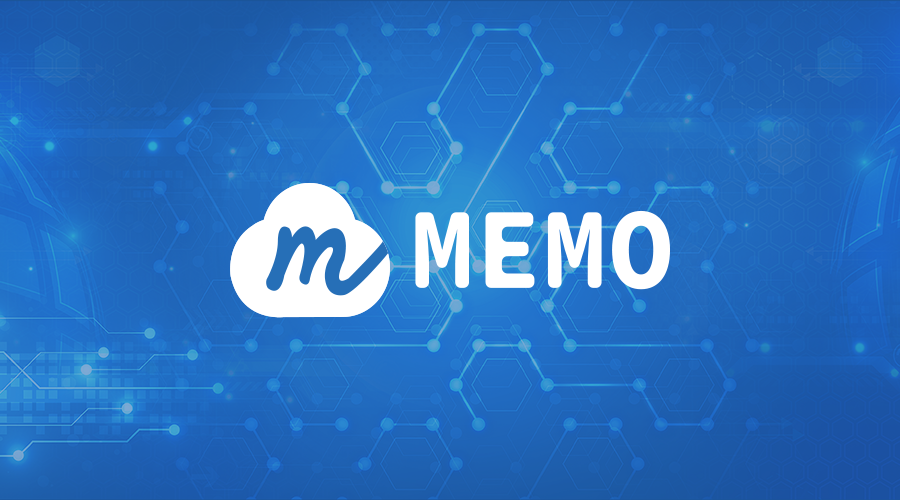

# MEFS

## Introduction

&nbsp;

Memo is a large-scale decentralized data storage system with high security and reliability built around blockchain. It is a new-gen blockchain decentralized cloud storage protocol that organizes global edge storage nodes to provide users with safe, reliable and highly available storage services.

&nbsp;
MEFS(MEmo File System) is the file storage system for MEMO.

&nbsp;

MEMO is a new-gen blockchain decentralized cloud storage protocol developed by MEMO Labs. Our mission is to build a reliable infrastructure for Web3.0. To achieve high scalability and availability, MEMO has vastly innovated data tiering, verification, fault tolerance, and recovery mechanisms. MEMO has made technological breakthroughs on blockchain cloud storage with a new architecture and multiple innovations.

&nbsp;

MEMO has designed three user roles: the User, the storage space user; the Provider, the storage space provider; and the Keeper, the coordination manager. Driven by smart contracts, three interconnected roles constrain each other.

&nbsp;

MEMO can be divided into three functional role-based layers: settlement, verification, and storage. The settlement layer processes settlement on-chain by aggregating order information and sending the amount of each order to the storage nodes Provider. The verification layer is conducted off-chain. The Keeper nodes challenge the Provider nodes, verifie the results of the proof, and decide whether to issue the withdrawal certificate to the Provider nodes. All processes on the verification layer will go through nodes on the same layer and pass the Byzantine fault-tolerant consensus. The storage layer consists of massive scattered Provider nodes, which store genuine User data and regularly submit the proof of storage to the verification layer.

&nbsp;

The following articles will help you learn more.

What is MEMO?

[Memoriae — Next Generation of Decentralized Cloud Storage Based on Blockchain](https://memolabs.medium.com/memoriae-next-generation-of-decentralized-cloud-storage-based-on-blockchain-9151ab8c1aaa)

Roles：

[Build an Autonomous Storage System: Role Design in Memoriae](https://memolabs.medium.com/build-an-autonomous-storage-system-role-design-in-memoriae-f724c405ddc)

[Memoriae System Node Matching](https://memolabs.medium.com/memoriae-system-node-matching-d246fca41009)

Technology：

[Multilevel Fault-tolerant Mechanism Design for MEMO Decentralized Cloud Storage System](https://memolabs.medium.com/multilevel-fault-tolerant-mechanism-design-for-memo-decentralized-cloud-storage-system-f3c585eb401d)

[MEMO Original Data Recovery Strategy: Risk-Aware Failure Identification (RAFI)](https://medium.com/memolabs/the-risk-aware-failure-identification-rafi-strategy-of-memo-decentralized-cloud-storage-system-6c5990ec8cb3)

&nbsp;  

### Sign up for Auth Token

The user clicks on the link to obtain test tokens in the Memoriae wallet (under development), and the system will send the user a test token of 10 Memo. When the user's test balance is not less than 10 Memo, they will not be able to apply for the test token again.

send an eail to [sup@memolabs.org](mailto:sup@memolabs.org) to apply for test tokens

Email subject: apply for test token

Email content: account address (format such as 0x...), role (Provider or Keeper or User)

&nbsp;

### Interactive Forum

Persons who are interested in decentralized data storage systems are welcome to join the Memo community and participate in interaction!

Our [GITHUB](https://github.com/memoio/testnet/issues) URL is:

<https://github.com/memoio/testnet/issues>

Our [TWITTER URL](https://twitter.com/Memo_Labs) is:

<https://twitter.com/Memo_Labs>

## Characteristics and Advantages

&nbsp;

**Decentralized storage.** After the user uploads the source file, the Memo system can distribute the data to multiple storage nodes and provide a unified standardized interface to the outside world. When the target user initiates a download request, the nearest node downloads the fragments by the nearest node and provides them to the user completely. Multiple images or copies are provided throughout the network, which greatly improves the access speed and stability.

&nbsp;

**Shared globally**.Multiple Memo devices can form a cluster effect to realize global data sharing, unified storage space management, and automatic load balancing of the cloud storage platform. Files can be distributed across regions and networks, supporting data storage and efficient use across the entire network , On-demand expansion to meet the needs of users for high-speed expansion.

&nbsp;

**Data security.** Data storage function is the cornerstone of Memo, and data security and reliability are the cornerstones of data storage function. Memo's data privacy policy requires data at its source-the client-that is encrypted with a user key before it is written to the edge storage device. In addition, the access control mechanism ensures that the data can be accessed by its owner or its maintainer and the store in collaboration, while not being accessed by other users, or unrelated maintainers and storers.

&nbsp;

**System reliability.** Memo's goal of ensuring reliability is to prevent data loss when user equipment, maintenance equipment, or edge storage equipment fails. Duplication, erasure coding, and other data redundancy technologies can be used to ensure the reliability of data stored on edge storage devices.

&nbsp;

**The original data recovery method--RAFI**. In addition to data redundancy mechanisms, data repair methods are also an important factor in determining data reliability. Memo's original data recovery method RAFI is used to further improve the reliability of data stored in edge storage devices. RAFI technology can optimize the edge storage space, and more guarantee the security of data and the stability of the system. Through real-time query, data with high risk of loss can be quickly found, effectively shortening the total time of data repair and improving performance.

&nbsp;

### Compared with Other Blockchain Storage Projects, What Is Special about MEMO?

MEMO is a blockchain-based decentralized cloud storage system. It's unlike some projects aiming at producing blocks whose storage data volume is directly linked to the calculation power of blocks; it is also different from pseudo-decentralized distributed storage projects, one of whose nodes or several usually undertake the function of 'centralized nodes'.

## Roles Design of Memo System

In the Memo distributed cloud storage system, each user can register a role according to his own needs. The system roles include User, Keeper, and Provider. If it is a storage demander, it is registered as a User; if it is a device provider, it is registered as a Provider; if it only provides information management services, it is registered as a Keeper. This article will explain the design principles of each role from the perspective of overall system operation.

The basic roles of the three parties are as follows:

1、User: is the consumer of the storage service in the system, puts forward storage requirements and uploads data

2、Keeper: It is the management coordinator in the system, responsible for information intermediary and management functions.

3、Provider: is the storage device provider in the system, providing storage space for users.

Among these three roles, User and Provider are the supply and demand parties of storage services, and User is also the end user in the system. In short, User uses storage space in the Memo system, Keeper finds a suitable storage node for User, and storage node Provider stores data for User. Keeper is equivalent to an intermediate information matchmaker, providing intermediary services for users and providers. We can understand Keeper as a headhunter on a recruitment platform or an intermediary in a real estate trading platform.

### Role conception

#### 1、User

Since the end user in the system is the User, it needs to pay the corresponding storage fee for the storage service, so every service request is initiated by the User.

When the User proposes a storage service demand, it should include the following elements: storage space size, storage duration; the number of Providers and Keepers; and the required storage unit price.

Because only after setting the above parameters, Keeper can retrieve and match the corresponding storage node. At the same time, in a decentralized cloud storage system, the more storage nodes, the more secure the data, but the more storage nodes, the higher the payment fee. Therefore, the Users need to determine the number of storage node Providers and intermediate managers Keepers by themselves, and need to find a balance between cost and data security.

The Users not only need to pay for storage services, but when they need to download data from the Provider, they also need to pay for the download, because the download operation will bring the Provider and the consumption of traffic and equipment.

Since the User is the ultimate payer, the system does not set special restrictions for this role, because if the User does not pay, the Provider and Keeper will stop the service. But for the other two roles, Provider and Keeper, the system has set corresponding punishment measures for them, which will be discussed below.

#### 2、Keeper

##### Basic functions

Keeper is an important intermediate role in the system. It assumes information intermediary and management functions, and extracts management commissions from the storage fees paid by the User.

As an information intermediary, its basic function is to match information, that is, to match information between the demand-side and demand-supply side. When the User puts forward storage requirements, Keeper will find the Provider connected to itself according to the User's requirements, and match the appropriate storage node.

In addition to basic information matching, Keeper's management functions are mainly embodied in participating in challenges and triggering payments. Keeper regularly initiates and participates in challenges to Providers. Its purpose is to verify whether Providers store data completely, that is, to verify the authenticity and honesty of Providers. According to the challenge results, we can get how much and how long data each Provider has effectively stored for the User during this period of time, which will be used as the basis for the User's later payment.

In addition, another important function of Keeper is to trigger payment for storage fees. The payment is not triggered by the payer User or the payer Provider, but the payment is triggered by the middleman Keeper. This is mainly for the consideration of increasing the fairness of the system. Triggering by the middleman Keeper can reduce the probability of fraudulent behavior.

​ Figure: Basic functions of Keeper

##### Punishment mechanism

Keeper, as an intermediary, participates in the management of the system.Although it can solve the trust problem of the storage supply and demand of the distributed storage system to a certain extent, it is considered that Keeper itself may lack integrity, such as not challenging the storage of data on time and not on time. To trigger payment, Memo therefore designed punishment measures for the role. The existence of the punishment mechanism can ensure the good operation of the system and the healthy development of the community to a certain extent.

Therefore, the system stipulates that when the account is registered as a Keeper, a fee must be pledged. This fee can be refunded by the account, or it can be deducted when the account violates the system regulations. If the amount of the account pledge is insufficient, or there is no pledge deposit amount, then there is no good faith endorsement, the Keeper role of the account cannot be established.Regarding the amount of Keeper pledge, when to deduct the penalty and how much to deduct can be determined off-chain.

Usually, when an account severely violates the system regulations, a penalty will be given to the account. If a Keeper is unable to perform the space-time challenge of storing data on time, synchronize the result of the space-time challenge and report the result of the space-time challenge for a long time, then the system will ban the account. Once the account is banned, it will never become a Keeper again.

When Keeper is disabled, if the balance pledged by the Keeper is not 0, then the balance can be handled as follows: return to the account; transfer to the role manager who deploys the role contract; transfer to the Keeper who violates the system rules Other accounts affected include User, Keeper, and Provider.

Figure: Keeper's penalty mechanism

#### 3、Provider

##### Basic functions

Provider is the party that provides storage space in the system. It provides storage services for the Users and obtains fees paid by the Users. After the Provider goes online, you need to explain your storage situation, which should include the available storage space, storage duration, and required storage unit price. After the Provider explains its own situation, Keeper can match according to the situation of both the User and the Provider, and then send the matched Provider information to the User, so that the User, Keepers, and Providers form a storage service.

Like Keeper, Provider also has the function of triggering payment, except that Keeper triggers the payment of storage fees, while Provider triggers the payment of download fees. This is because the verification of storage fees requires the participation of the intermediate manager Keeper, while the download fee is Verification does not require the participation of intermediate managers.

##### Punishment mechanism

The penalties for breach of the Keeper mentioned above. For Provider, the system also designs rewards and punishments, because the Provider may have problems such as corrupted data but not recovering, long-term failure to respond to User download data requests or Keeper challenges.This will not only destroy the User's data, but also seriously affect the user experience.

Therefore, for the Provider role, it is also necessary to pledge a fee when applying for the role. Once the Provider violates the system rules, the system will trigger the corresponding penalty to deduct the pledge deposit amount.

##### Penalty contract deployer:third-party contract manager Admin

From the perspective of system design, each role can gain something in the Memo system. Since User is the ultimate consumer, and the punishment measures are mainly for the collection role, that is, for Keeper and Provider, the realization of system role functions and the interaction between roles are realized through smart contracts, so the punishment is also realized by smart contracts. of.

The reason for adopting the contract-based penalty mechanism is: a decentralized system deployed in a low-credibility environment, there is no specific organizational decision, implementation of rewards and punishments, and the contract has all the terms and execution processes that are formulated in advance and are The advantage of being carried out under the absolute control of the computer. In addition, after the smart contract is compiled, it is deployed on the blockchain and executed by the virtual machine, and every node on the blockchain will run the process of the smart contract, so the execution process and execution of the smart contract can be realized that the result is distributed supervision and arbitration.

With the help of these advantages of smart contracts, the penalty mechanism for Provider and Keeper can be specified in the contract in advance. For the problem of who triggers the pledge deduction function of smart contracts, the available solutions are: triggered by User; triggered by Keeper; triggered by other Providers; or triggered by the role contract deployer.It is inappropriate for any role in the system to trigger the deduction of the pledge function of Provider and Keeper. The reason is that the three of them are related to each other in a storage service.Provider obtains revenue by storing data for User, and Keeper obtains revenue by helping User challenge verification data and collect information.Therefore, the power to trigger the deduction of pledge function should be transferred to an unrelated third party, that is, the role contract deployer, here called the contract manager Admin. The Admin deploys the penalty contract, which is also one of the checks and balances designed by the Memo system to achieve fair transactions.

## Requirements of each Role

### Hardware Requirements

The Keeper and the Provider should stay online for a long time

### System Requirements

Ensure the security of the keystore file

### User

Recommended configuration：

Recommended configuration: 4 cores, 8G memory, 20Mbps bandwidth;

External network ip, port 4001 is usable;

Docker environment;

### Keeper

Recommended configuration：

4-core processor, 8G running memory, 200GB storage space, 20Mbps network bandwidth;

Internet ip address, port 4001 is open;

Docker environment;

### Provider

Recommended configuration：

4 cores, 8G memory, 1TB storage, 20Mbps bandwidth;

External network ip, port 4001 is usable;

Docker environment;

## About RAFI

RAFI as a new Risk-Aware Failure Identification strategy, it uses different time thresholds to identify strip failures of different numbers of failed blocks, so as to improve the overall data reliability and availability with a shorter identification time.

&nbsp;

[learn more](https://www.usenix.org/conference/atc18/presentation/fang)
