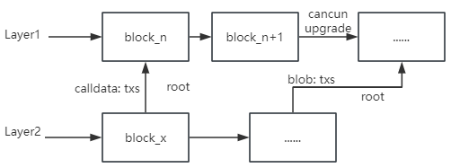
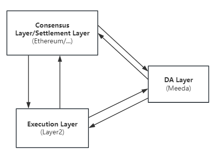
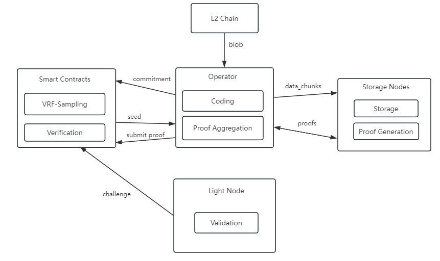

# Meeda

Meeda is a data availability solution based on Ethereum security launched by [Memolabs](https://memolabs.org/), providing reliable data availability guarantee for Ethereum Rollup.

Meeda is named after the words MEMO, Ethereum, and data availability, and is linked with Mooda, the Bitcoin data availability solution launched by Memolabs. The first two letters together form MEMO.

## DA problem

For blockchain, data availability (DA) is a very important thing. As we all know, consensus is an important part of blockchain. Nodes reach consensus and jointly maintain the state of the current chain. In order for nodes to reach consensus, they first need to recognize the state change of the current chain. To verify whether the state change of the current chain is correct, they need to be able to access transaction data, execute transactions to obtain transaction results, and thus verify whether the state change of the current chain is correct. Therefore, ensuring that transaction data can be accessed by any node is a very important part of the normal operation of the blockchain.

Ensuring that transaction data can be accessed by any node is called data availability (DA). Any node can access the transaction data contained in the unconfirmed blocks to verify whether the transaction is correct, thereby preventing malicious transactions from being uploaded to the chain, maintaining the correct "bookkeeping" records of the blockchain, and ensuring the security and reliability of the blockchain. For a more detailed description of data availability, please refer to https://ethereum.org/en/developers/docs/data-availability/.

In a monolithic blockchain like Ethereum, DA is usually used as part of a single system design. When the block space is limited and the block space utilization rate is high, the gas fee will become higher and higher, the cost of a single transaction will become higher and higher, the user experience will become worse, and the development of Web3 will be restricted.

In recent years, Ethereum has also realized the expansion problem and began to explore various off-chain expansion solutions. At present, Rollups has become a popular solution, but when the Web3 ecosystem is prosperous and the demand for block space is high, it still faces the problem of excessively high gas fees.

### Current DA solution

Layer2, as Ethereum's expansion solution, has been able to safely and reliably expand Layer1, improve throughput and reduce transaction fee overhead. But it still has a problem: it cannot reduce data synchronization overhead and storage overhead. The original transaction data still needs to be submitted to the L1 chain, and the full nodes on L1 still need to synchronize these transaction data. Even if there are some other solutions, such as ERC-4337 to compress some transaction data, and EIP-4844 introduces the `blob` transaction type, the effect is still limited. The most intuitive manifestation is that these transaction data still need to pay high gas fees when stored on the L1 chain, although these fees are byte fees rather than execution fees.

The root cause is that Layer2 regards the Ethereum L1 chain as its own DA layer.

## Meeda Solution

### Meeda Overview

Meeda stores blob data off-chain, and stores the index used to obtain data and the commitment certificate to ensure data availability on-chain. While ensuring data availability, it also reduces the synchronization overhead and storage overhead on the chain, and expands the blockchain to the greatest extent. Meeda is compatible with any Optimistic Layer2 chain, providing reliable data availability guarantees. Meeda relies on on-chain verification, continuous proof, and redundancy mechanisms to ensure data availability.

Off-chain, Rollup uploads blob data to Meeda, which guarantees the availability of blob data, and any node can quickly and easily read blob data. On-chain, Meeda will regularly submit data availability proofs to the chain.

### Meeda Architecture

The following picture shows the basic architecture information of Meeda.

Meeda's architecture contains four main components:

1. Operator: Receive blob data, redundantly encode and split the blob data, and then disperse it to Storage Nodes; generate index information commitment of blob data and upload it to the chain so that users can obtain data; aggregate the data availability commitment proof generated by Storage Nodes, and submit the aggregated proof to the chain for on-chain verification.

2. Storage Nodes: Nodes that store blob data; based on the seed information generated on the chain period, continuously generate data availability commitment proof and send it to Operator.

3. Verification contract: Mainly responsible for on-chain verification. Generate seed information according to the VRF-Sampling (Verifiable Random Function) cycle for subsequent proof generation and proof verification; verify the continuously submitted aggregated proof; and save the index information commitment used to obtain data.

4. Light Node: Challenges on-chain verification.
