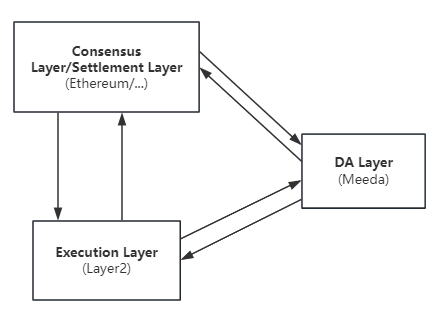

# What is Meeda

Meeda is a data availability solution based on Ethereum security launched by [Memolabs](https://memolabs.org/), which provides reliable data availability guarantee for Ethereum Rollup.

Meeda is named after the words MEMO, Ethereum, and data availability, and is linked to Mooda, the Bitcoin data availability solution launched by Memolabs. The first two letters together form MEMO.

## DA problem

For blockchain, data availability (DA) is a very important thing. As we all know, consensus is an important part of the blockchain. The nodes reach a consensus to jointly maintain the status of the current chain. In order for nodes to reach consensus, they first need to recognize the status changes of the current chain. To verify whether the status changes of the current chain are correct, they need to be able to access transaction data, execute transactions and obtain transaction results, thereby verifying whether the status changes of the current chain are correct. Therefore, ensuring that transaction data can be accessed by any node is a very important part of the normal operation of the blockchain.

Ensuring that transaction data can be accessed by any node is called data availability (DA, Data Availability). Any node can access the transaction data contained in the blocks that have not been finally confirmed to verify whether the transaction is correct, thereby preventing malicious transactions from being uploaded to the chain, maintaining the correct "accounting" record of the blockchain, and ensuring the security of the blockchain. reliability. For a more detailed description of data availability, please refer to https://ethereum.org/en/developers/docs/data-availability/.

In an overall blockchain like Ethereum, DA is usually used as part of a single system design. When the block space is limited and the block space utilization is high, the gas fee will become higher and higher, and the cost of a single transaction will become higher and higher. The higher the value, the worse the user experience will be and the development of Web3 will be restricted.

Ethereum has also become aware of the expansion problem in recent years and has begun to explore various off-chain expansion solutions. Currently, Rollups have become a popular solution. However, when the Web3 ecosystem is prosperous and the demand for block space is high, it still faces the problem of excessive gas fees.

### Current DA solution

As an expansion solution for Ethereum, Layer2 can safely and reliably expand Layer1, improve throughput and reduce transaction fees. But there is still a problem: it cannot reduce data synchronization overhead and storage overhead. The original transaction data still needs to be submitted to the L1 chain, and the full nodes on L1 still need to synchronize these transaction data. Even though there are some other solutions, such as ERC-4337 to compress some transaction data, and EIP-4844 introducing the `blob` transaction type, the effect is still limited. The most intuitive manifestation is that these transaction data still require high gas fees to be stored on the L1 chain, although these fees are byte fees rather than execution fees.

The fundamental reason is that Layer2 regards the Ethereum L1 chain as its own DA layer.

## Meeda solution

### Meeda Overview

Meeda stores blob data off-chain, and stores the index used to obtain the data and the commitment proof to ensure data availability on the chain. While ensuring data availability, it also reduces synchronization overhead and storage overhead on the chain, maximizing the expansion of the blockchain. Meeda is compatible with any Optimistic type Layer2 chain, providing reliable data availability guarantee. Meeda relies on on-chain verification, continuity proof, and redundancy mechanisms to ensure data availability.

Off-chain, Rollup uploads blob data to Meeda. Meeda ensures the availability of blob data, and any node can read blob data quickly and easily. On the chain, Meeda will regularly submit data availability certificates to the chain.

### Meeda Architecture

The picture below shows the basic architectural information of Meeda.

Meeda's architecture consists of four main components:

1. Operator: Receive blob data, redundantly encode and segment the blob data, and then send it to Storage Nodes; generate index information commitment of blob data and upload it to the chain so that users can obtain the data; aggregate Storage Nodes to generate Proof of data availability commitment and submit the aggregated proof to the chain for on-chain verification.
  
2. Storage Nodes: Nodes that store blob data; based on the seed information generated periodically on the chain, data availability commitment certificates are continuously generated and sent to the Operator.
  
3. Verification contract: Mainly responsible for on-chain verification. Generate seed information according to the VRF-Sampling (Verifiable Random Function) cycle for subsequent proof generation and proof verification; verify the continuously submitted aggregate proof; and save the index information commitment used to obtain data.
  
4. Light Node: Challenge on-chain verification.
