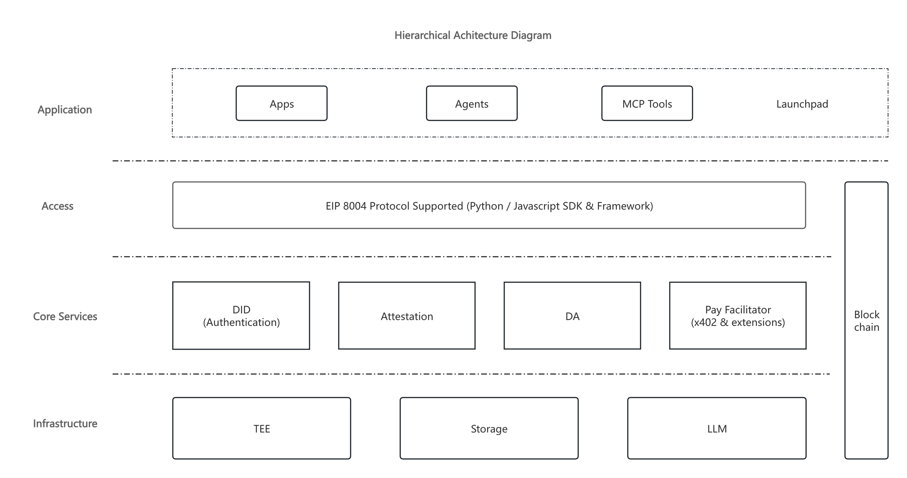
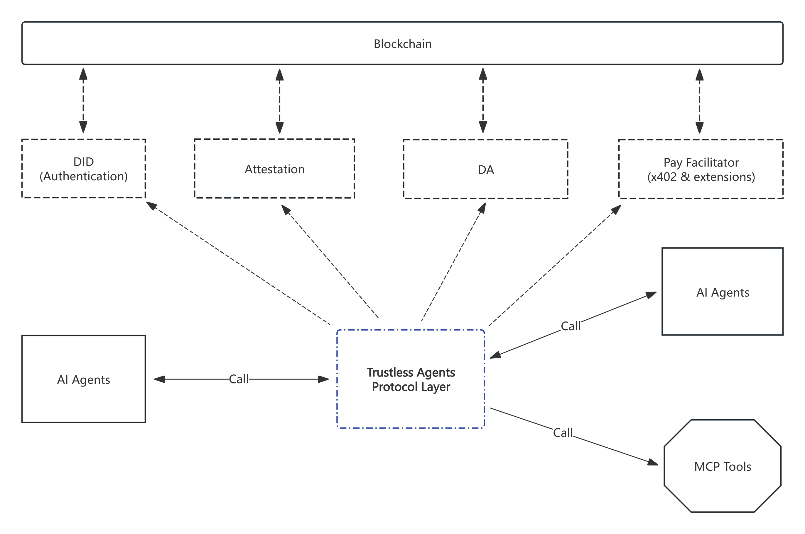

# MEMO AI Agent — Introduction

## Overview

MEMO is building a trustworthy, open and extensible Web3-native infrastructure that exposes identity (DID), attestation, data availability (DA) and payment capabilities as reusable service layers for diverse applications. In the era of rapidly emerging AI Agents, MEMO drives the next stage:
**Seamlessly embedding highly trusted, verifiable, payable and interactive blockchain capabilities into AI Agents, enabling them to truly manage on-chain assets, access on-chain data and execute on-chain tasks autonomously.**

Within this context, the MEMO AIAGENT documentation set introduces a complete set of mechanisms that allow an Agent to safely perform transactions, invoke protocols and finish payments on-chain, including:

* x402: On-chain payment capability specification for AI Agents
* EIP-8004: Standardized invocation protocol between Agents and on-chain services
* DID / Attestation / DA: Trustworthy identity & execution infrastructure for Agents

This Introduction document is the entry point to the entire AI Agent documentation system, helping you progressively understand how MEMO builds a **verifiable, payable and collaborative** Agent ecosystem.

## Why AI Agents Need MEMO

Traditional AI Agents can execute logic, but they lack:

* **Trustworthy Identity** (cannot prove “who am I”)  
* **Trustworthy Authorization** (cannot prove “which actions am I allowed to perform”)  
* **Verifiable Execution** (cannot prove “I actually performed this action”)  
* **Native Payment Capability** (cannot handle fees, cross-chain transfers, task payments on-chain)  
* **Auditable Result Evidence** (cannot provide verifiable proofs of execution)  

MEMO’s base services map exactly to these gaps:

| Agent Capability Need | MEMO Provides |
| --------------------- | ------------- |
| Identity | DID (EIP-7007) |
| Authorization & Proof | Attestation |
| Execution Trustworthiness | TEE + DA |
| Payment | x402 + Pay Facilitator |
| Calling On-chain Services | EIP-8004 |
| Data Source | DA / Storage |

Thus an AI Agent is no longer “just a chatty task runner”, but becomes an autonomous entity with **on-chain identity + on-chain payment ability + verifiable execution + wallet-native capability + service invocation**.

## MEMO Architecture for AI Agent

From bottom to top the layered architecture is:

### Infrastructure Layer

TEE, Storage, LLM — provide foundational compute and environment for Agent execution & data.

### Core Services Layer

Composed of MEMO core modules:

* **DID (Authentication):** Provides independent identity for the Agent
* **Attestation:** Supplies proofs for permissions, claims and actions
* **DA (Data Availability):** Ensures data availability between the Agent and on-chain tasks
* **Pay Facilitator (x402 & extensions):** Offers on-chain payment capabilities (gas payment, cross-chain settlement)

### Access Layer

Through the **EIP-8004 standard protocol** (with Python / JavaScript SDKs) it exposes unified service invocation interfaces for Agents, applications and MCP tools.

### Application Layer

Finally composed of Apps, Agents, MCP Tools and Launchpad.

This shows: **An AI Agent is a trusted execution body built atop the full MEMO infrastructure, accessing all on-chain functionality via EIP-8004.**

## Trustless Agent Protocol Layer

This diagram further illustrates the core role of the **Trustless Agents Protocol Layer**:

* Serves as the intermediary protocol layer between AI Agents and blockchain services  
* Every on-chain interaction (authentication, attestation, DA, payment) passes through this layer  
* DID, Attestation, DA and x402 payment modules each provide verifiable capabilities via the blockchain  
* The Agent invokes this layer to perform real on-chain operations such as:  
    * Creating & using DID  
    * Obtaining / submitting Attestations  
    * Initiating task payments (x402)  
    * Accessing on-chain data  
    * Interacting with users, applications, MCP tools  

Therefore MEMO’s Agent is not a “centralized API + LLM model” traditional construct, but **an autonomous on-chain entity with identity, provable actions, payment capability and intelligent task execution.**

## x402: Enabling Payments for AI Agents

x402 (and its extensions) is the payment foundation for AI Agents on-chain. It answers:

* How an Agent automatically pays gas for tasks  
* How an Agent receives funds  
* How an Agent manages its on-chain balance  
* How multi-task collaboration costs are settled among agents  
* How cross-chain fee handling works  

**x402 is the critical base allowing an AI Agent to “self-execute tasks”.**

In the /x402 directory you will find:

* x402 protocol overview  
* Usage scenarios  
* Agent payment examples  
* Relationship with Pay Facilitator  

## EIP-8004: The Access Layer for Agents

EIP-8004 is the unified interface specification between AI Agents and the underlying on-chain infrastructure, standardizing:

* How an Agent performs DID registration / resolution  
* How an Agent submits / verifies Attestations  
* How an Agent accesses DA  
* How an Agent performs payments (together with x402)  
* How an Agent accesses Storage or a TEE  

EIP-8004 builds a standardized SDK & framework for the entire MEMO AIAGENT stack, letting developers use one API surface to create:

* AI Agents  
* MCP Tools  
* Upper layer applications (Apps / Launchpad)  
